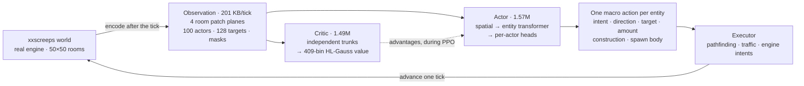
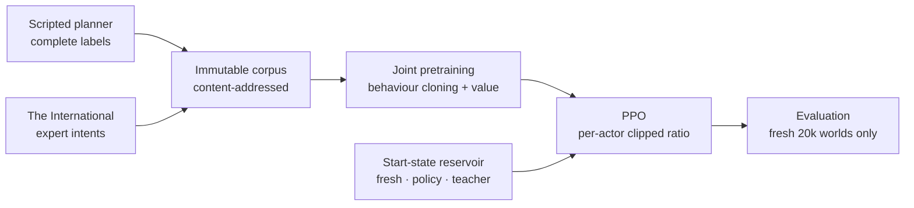

# Screeps RL

Reinforcement learning for [`xxscreeps`](../../README.md). A single neural policy
runs a whole Screeps colony, picking one masked macro action for every creep,
spawn and tower on every tick. It is first cloned from two teachers, a scripted
planner and [The International](https://github.com/The-International-Screeps-Bot/The-International-Open-Source),
then trained with PPO against the live simulator. This is a research stack, not a
competitive bot.

## Results

| Cloned from the teachers | After PPO |
|:---:|:---:|
|  |  |

Twelve seconds from each of two full runs, both recorded with
[`tools/record_showcase.py`](./tools/record_showcase.py). The cloned policy
reproduces the teachers' whole repertoire, laying construction sites, building,
hauling and upgrading, but it does all of it thinly: sites end up scattered
across the room instead of clustered into a base, most are never finished, and
the colony is still at RCL2 after 40,000 ticks. The reinforced policy saturates
both energy sources with about 30 creeps, recovers dropped energy, runs a hauling
lane to the controller and reaches RCL3 in 7,600 ticks, while placing no
construction sites at all.

Scores below come from ten fresh, untouched 20,000-tick worlds at a seed used by
neither training nor teacher collection, decoded greedily. The quantity is
`harvested_energy + controller_progress` per tick.

| Scenario | Score/tick |
|---|---:|
| `empty`, one spawn in a bare room | 17.1 |
| `seed_creep`, one seeded worker | 18.5 |
| `seed_claimer`, plus 2 room claims | 17.4 |
| `seed_full`, an inherited mature colony | 13.1 |
| `seed_outpost`, a neutral outpost | 16.6 |

Which states PPO trains on matters more than anything else measured here. A
second run, identical but for its start states, reaches 4.0.


Both runs start from the same cloned checkpoint with a working 50-creep colony.
The run restricted to tick-zero starts loses that colony by update 60, never
recovers it, and settles at a score of 4; the run drawing from the reservoir
holds 27 to 35 creeps and climbs past 15. The held-out evaluation, summed over
the five scenarios above, separates them the same way:

| | Reservoir | Tick-zero only |
|---|---:|---:|
| Score per tick | 82.7 | 20.0 |
| Controller progress rate | 27.2 | 0.1 |
| Remote-room harvesting | 32,228 | 0 |
| Remote energy delivered home | 311 | 0 |
| Room claims | 2 | 0 |

Behaviour changes during PPO, as intents issued per update, averaged over the
first ten updates against the last forty:

| Behaviour | Early | Late | Change |
|---|---:|---:|---:|
| `upgradeController` | 16,090 | 42,134 | 2.6x |
| `pickup`, recovering dropped energy | 5,245 | 12,600 | 2.4x |
| `move`, deliberate repositioning | 107 | 5,118 | 48x |
| `harvest` | 43,806 | 27,309 | 0.6x |
| `build` | 6,220 | 135 | 0.02x |
| `createConstructionSite` | 47 | 12 | 0.3x |

Harvest intents fall while delivered energy rises, so the policy is issuing
fewer, longer-lived harvesting decisions rather than harvesting less.

## Limitations

Construction is the clearest one. It survives PPO only as low-probability policy
mass, enough to appear under sampled decoding and never enough to be the greedy
action. The cause is not established. Discounting is the obvious candidate, since
`gamma = 0.995` gives an effective horizon of 200 ticks while an extension costs
thousands of energy now and repays through cheaper bodies over thousands of
ticks.

Any explanation has to account for the counterexamples, though. Spawning is
delayed payoff too, since a body costs about 300 energy and repays over a life of
roughly 1,500 ticks, and it was retained at 0.85x of its early rate with 27 to 35
creeps sustained. Remote harvesting has a round trip of hundreds of ticks and
grew rather than shrank. Whatever suppressed construction did not suppress
delayed payoff in general, so this needs an experiment rather than an argument.
[`docs/ROADMAP.md`](./docs/ROADMAP.md) carries the candidates and the measurement
that would separate them.

The 512-tick rollout and that 200-tick horizon were both chosen to fit the loop
on one GPU, and they are the most likely ceiling on further progress. Neither is
cheap to lift: longer rollouts cost collection time linearly, and a longer
horizon costs advantage variance.

Also undemonstrated: economy-funded expansion, sustained remote logistics late in
a lifecycle, and structure placement good enough to be worth building. Every
count in this document names its decode, because greedy evaluation hides
behaviour that exists only in sampled policy mass.
[`docs/ROADMAP.md`](./docs/ROADMAP.md) tracks all of it.

## Design



A learned action is a goal rather than a keystroke: harvest that source, transfer
to that structure, claim that controller. The executor takes one navigation or
work step toward it, with traffic-aware movement and routes cached for ten ticks,
so the network never spends capacity choosing among eight directions per step.
The policy reselects its goal every tick and can abandon a plan mid-route.

| Factor | Choices | Active when |
|---|---:|---|
| Intent | 20 | always |
| Direction | 8 | the intent is directional |
| Target | 128 candidates | the intent needs an object |
| Amount | 10 bins | the intent moves resources |
| Construction | 7 types x 2,500 tiles | room actors only |
| Spawn body | 8 part counts plus a learned part order | spawns only |

Inactive factors are masked out of the likelihood, so they never enter cloning,
entropy or the PPO ratio. Legality is treated as part of the action definition:
candidate masks, model compatibility, executor validation and engine behaviour
all describe the same executable action, and a legal intent with no executable
argument is never offered. That keeps invalid actions rare enough to report as a
defect rather than a rate, at 2 out of 344,078 in the recorded run.

Spawn bodies are the one genuinely awkward factor, since a body is up to 50 parts
drawn from 8 types. One neural pass emits count logits for all eight types, then
a fixed conditional scan masks them so every sampled composition is non-empty, at
most 50 parts, and affordable at the room's current energy. A Plackett-Luce head
orders only the types with non-zero counts and the rest take a canonical suffix,
so each executed body has exactly one encoding. There is no length choice, no
50-step decoder and no energy reservation across ticks.

The critic predicts a 409-bin HL-Gauss distribution over a signed-log support
instead of regressing a scalar, because returns span orders of magnitude between
an empty room and a mature colony, and targets outside the support fail loudly
rather than being clipped. Observations are encoded after the tick is applied, so
each decision sees the consequences of the last one; terminal observations are
kept for value bootstrap and trajectory chains are cut at truncation. All
coordination happens within a tick, with no temporal attention and no recurrent
state, which is why long-lived tasks are
[roadmap](./docs/ROADMAP.md#temporal-memory-and-options) work.

## Training



The two teachers do different jobs. The scripted planner supplies complete labels
and the empty-room-to-expansion qualification target. The International plays
considerably better, and its raw engine intents give exact conservative labels for
targets, construction and spawn composition, but only where they map onto the
macro action ABI; immediate moves and multi-command ticks are dropped instead of
guessed. Lifecycles are collected once into an immutable, content-addressed
artifact with finite-horizon value targets computed up front, and training refuses
a different corpus on resume, so any cloning result traces back to exact data.

PPO clips likelihood ratios per live actor, averages them within a team state and
then across transitions, so a 40-creep colony carries no more weight than a
4-creep one. It uses `gamma = 0.995`, `lambda = 0.95`, advantages normalized once
per rollout, and time-limit terminals that bootstrap value instead of truncating
credit silently. Both stages share one optimizer: Muon with Polar Express
orthogonalization and NorMuon second-moment reweighting on the hidden transformer
matrices, fused AdamW on embeddings and heads, and no learning-rate schedule.

The objective is `0.1 x harvest + 1.0 x controller_progress` and nothing else.
Delivery, construction, claims and spawning stay diagnostics and qualification
gates, since gross deltas are gameable and a fixed claim bonus would swamp
economic quality.

### Start states

Twelve environments that all begin at tick zero advance in lockstep, so each
update draws from one narrow band of a 20,000-tick timeline. Behaviour that only
matters later, such as remote hauling, replacement and recovery, stops appearing
in the batch and is unlearned; the control run in
[Results](#results) shows exactly that, with its training reward halving while
entropy, gradient norm and KL collapsed toward zero.

PPO therefore draws start states from an event-stratified reservoir. Half the
fleet stays on untouched full lifecycles, which are the only worlds whose late
states follow from the policy's own earlier decisions. The rest resume from
snapshots of recent policy runs, successful and failed, and a temporary teacher
lane bridges phases the policy cannot reach yet, retiring per phase once the
policy supplies its own examples.

Snapshots are stratified by event rather than sampled periodically, since
periodic sampling overrepresents long plateaus. Captured events include
pre-spawn, pre-claim, outbound to a remote source, loaded and returning,
replacement due, and RCL transitions. Capturing before a decision matters most:
resuming after the teacher has chosen a body and placed a structure would train
execution of a decision the policy never made, so the snapshot leaves it open.
Evaluation never uses snapshots, since a policy scored from restored states is
never required to reach them. The full contract is in
[`docs/TRAINING.md`](./docs/TRAINING.md#start-states).

## Running it

Requires Python 3.10+, Node 22+, PyTorch, NumPy and TensorBoard. Local training
and GPU evaluation go through `mlq`, and `runs/` is gitignored, so a clean clone
produces its own artifacts.

```bash
export RL_NODE="$(mise exec node@24 -- which node)"

# Contracts: model, action ABI, reward, teacher, environment
python3 -m samples.rl.agent.test_latent_unit
python3 -m samples.rl.agent.eval_scripted --ticks 20000 --max-episode 20000 --seed 3
python3 -m samples.rl.agent.eval_reward_contract
```

Watch a policy play, live in the Screeps client at `http://127.0.0.1:21025` or as
a 2K recording with a time lapse:

```bash
python3 -m samples.rl.agent.watch \
  --checkpoint samples/rl/runs/policy.pt --headful --deterministic --ticks 20000

python3 samples/rl/tools/record_showcase.py \
  --checkpoint samples/rl/runs/policy.pt \
  --out samples/rl/runs/showcase/run --ticks 40000
```

Training runs in three queued stages. The first prints a content-addressed corpus
path that the second consumes.

```bash
mlq submit --name screeps-corpus --priority 10 --max-parallel-runs 1 --cwd "$PWD" -- \
  python3 -m samples.rl.agent.pretrain_corpus \
    --num-envs 32 --steps 20000 --max-episode 20000 \
    --curriculum empty,seed_creep,seed_full,seed_claimer,seed_outpost \
    --ti-actor-steps 20000 --output samples/rl/runs/pretrain-corpora

mlq submit --name screeps-pretrain --max-parallel-runs 1 --cwd "$PWD" -- \
  python3 -m samples.rl.agent.pretrain_joint \
    --corpus samples/rl/runs/pretrain-corpora/<sha256> \
    --global-epochs 16 --seed 3 --device cuda \
    --save samples/rl/runs/joint_pretrain.pt

mlq submit --name screeps-ppo --max-parallel-runs 1 --cwd "$PWD" -- \
  python3 -m samples.rl.agent.train \
    --resume samples/rl/runs/joint_pretrain.pt --save samples/rl/runs/policy.pt \
    --device cuda --compile --seed 3 \
    --num-envs 12 --steps 512 --minibatch 1536 --max-episode 20000 \
    --curriculum empty,seed_creep,seed_full,seed_claimer,seed_outpost \
    --reservoir samples/rl/runs/reservoirs/run \
    --start-mix fresh=6,policy=4,teacher=2 --segment-ticks 2048

mlq submit --name screeps-eval --max-parallel-runs 1 --cwd "$PWD" -- \
  python3 -m samples.rl.agent.eval_closed_loop \
    --checkpoint samples/rl/runs/policy.pt --ticks 20000 --num-envs 10 --seed 900
```

Teacher snapshots for the reservoir's bridge lane are collected once with
`samples.rl.agent.teacher_snapshots`. A PPO resume restores weights, both
optimizers, reward normalization, counters and RNG state, but environments
restart, so it continues the optimization rather than the trajectories.

One update is 512 ticks across 12 environments stepped in parallel followed by 12
optimizer steps, about 16 seconds on one RTX 5090 with 7.7 of that in collection.
`--compile` CUDA-graphs the per-tick forward and makes collection 1.7x faster;
[`docs/PERFORMANCE.md`](./docs/PERFORMANCE.md) has the measurements, including two
compile configurations that were tried and rejected on memory.

## Related work

[Overmind-RL](https://github.com/bencbartlett/Overmind-RL) is the other public
Screeps RL project. It is a 2020 course environment for official-server micro:
creeps injected for 300 ticks into empty plains, either 8-dir `move` toward
each other or `{approach, avoid}` while Overmind scripts combat. No economy,
spawn, or construction. The policy is stock rllib PPO, or a 4→30→8 MLP in the
notebook. The paper claims 1,900 room-ticks/s on 64 cores; the committed
cluster config does not match that, and per-core it is still the official
server's ~30 Hz. Throughput contrast lives in
[`docs/PERFORMANCE.md`](./docs/PERFORMANCE.md#external-baseline-overmind-rl).

This stack is a colony controller on `xxscreeps`, not a remake of that
sandbox. Combat is the one skill they demonstrated and this policy has not.

## Repository layout

```text
samples/rl/
  schema.json   # capacities, action ABI, model and PPO configuration
  env/          # simulator server, encoder, executor, scripted teacher
  agent/        # model, PPO, optimizer, reservoir, training, evaluation
  tools/        # showcase recorder
  docs/         # architecture, training gates, performance, decisions, roadmap
  runs/         # local checkpoints, metrics, videos (gitignored)
```

| Document | Contents |
|---|---|
| [`docs/ARCHITECTURE.md`](./docs/ARCHITECTURE.md) | Implemented model and environment contract |
| [`docs/TRAINING.md`](./docs/TRAINING.md) | Executable training, qualification and evaluation gates |
| [`docs/PERFORMANCE.md`](./docs/PERFORMANCE.md) | Measured bottlenecks, transport, compilation |
| [`docs/DECISIONS.md`](./docs/DECISIONS.md) | Conclusions that should outlive individual experiments |
| [`docs/ROADMAP.md`](./docs/ROADMAP.md) | Open blockers and unresolved experiments |
