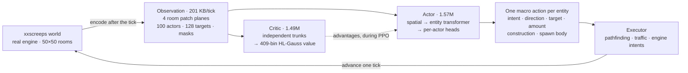
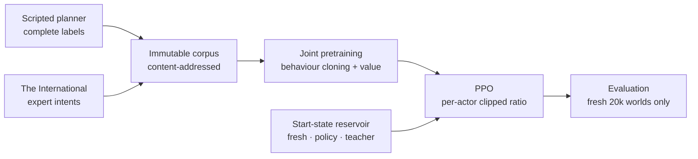

# Screeps RL

Reinforcement learning for [`xxscreeps`](../../README.md). One neural policy runs
a whole Screeps colony, choosing a masked macro action for every creep, spawn and
tower on every tick.

Training has two stages. The policy first clones two teachers: a scripted planner
and [The International](https://github.com/The-International-Screeps-Bot/The-International-Open-Source),
one of the strongest open-source Screeps bots. PPO then takes over against the
live simulator.

This is a research stack rather than a competitive bot. The sections below give
what it does, what it fails at, and the measurements behind both.

## Cloning, then reinforcement

| After behaviour cloning | After PPO |
|---|---|
|  |  |
| The cloned policy reproduces the teachers' full repertoire. It lays construction sites, builds, hauls and upgrades, but thinly. Sites end up scattered across the room instead of clustered into a base, most are never finished, and the economy is still at RCL2 after 40,000 ticks. | PPO saturates both energy sources with about 30 creeps, recovers dropped energy, runs a hauling lane to the controller and reaches RCL3 in 7,600 ticks. It places no construction sites and builds nothing. |

Both clips are 12 seconds from full runs recorded with
[`tools/record_showcase.py`](./tools/record_showcase.py).

## What it does

The current best policy, scored on ten fresh, untouched 20,000-tick worlds at a
seed used by neither training nor teacher collection. The score is
`harvested_energy + controller_progress` per tick under greedy decoding.

| Scenario | Score/tick | Behaviour |
|---|---:|---|
| `empty`, bare room with one spawn | 17.1 | Grows to about 30 creeps, saturates both sources, reaches RCL3 |
| `seed_creep` | 18.5 | The same, starting from a seeded worker |
| `seed_claimer` | 17.4 | The same, plus 2 room claims |
| `seed_full` | 13.1 | Operates an inherited mature colony |
| `seed_outpost` | 16.6 | Works a neutral outpost |

A second PPO run, identical except for the states it trained from, scores 4.0.
Closing that gap took a change of data distribution rather than a larger network.
See [start states](#start-states).

### What reinforcement improves, and what it drops

Intents issued per update, averaged over the first ten updates while the policy
is still close to its cloned initialization, against the last forty.

| Behaviour | Early | Late | Change |
|---|---:|---:|---:|
| `upgradeController` | 16,090 | 42,134 | 2.6x |
| `pickup`, recovering dropped energy | 5,245 | 12,600 | 2.4x |
| `move`, deliberate repositioning | 107 | 5,118 | 48x |
| `harvest` | 43,806 | 27,309 | 0.6x |
| `build` | 6,220 | 135 | 0.02x |
| `createConstructionSite` | 47 | 12 | 0.3x |

The held-out evaluation, against the control run that only ever started at tick
zero:

| | Reinforced | Control |
|---|---:|---:|
| Score per tick, summed over five scenarios | 82.7 | 20.0 |
| Controller progress rate | 27.2 | 0.1 |
| Remote-room harvesting | 32,228 | 0 |
| Remote energy delivered home | 311 | 0 |
| Room claims | 2 | 0 |

Upgrading, energy recovery, deliberate movement and remote work all improve
substantially. Construction is suppressed by a factor of 46 and claiming stays
rare. Fewer `harvest` intents alongside much more delivered energy is the same
result from another angle: less time spent re-deciding, more time working.

### Construction, and what is not yet known about it

Construction survives PPO only as low-probability policy mass: enough to appear
under sampled decoding, never enough to be the greedy action. Two explanations
are plausible and the evidence here does not separate them.

The first is discounting. `gamma = 0.995` gives an effective horizon of
`1/(1-gamma) = 200` ticks, and an extension costs thousands of energy now while
repaying through cheaper bodies over thousands of ticks.

The second is that placement is never supervised. The teacher's construction
labels carry an arbitrary legal tile, so cloning teaches which structure type to
build but not where, and the cloned policy scatters sites across the room rather
than clustering them near the spawn and the sources. Structures in arbitrary
positions repay little at any horizon, so dropping them can be correct rather
than short-sighted.

Two observations argue against discounting as the whole story. Spawning is also
delayed payoff, since a body costs energy now and repays over a life of roughly
1,500 ticks, and it was retained: `spawnCreep` intents held at 0.85x and the
policy sustains 27 to 35 creeps. Remote harvesting has a round trip of hundreds
of ticks before energy arrives home, and it grew rather than shrank. Whatever
suppressed construction did not suppress delayed payoff in general.

The experiment that would separate the two is cheap: give the policy a
well-placed base and measure whether its throughput improves within a few
hundred ticks. If good placement pays back inside the current horizon, the
blocker is placement learning rather than the discount.

The 512-tick rollout and the 200-tick horizon were both chosen to fit the loop on
one GPU: 512 ticks across 12 environments gives 6,144 transitions per update, at
about 16 seconds of wall time. They are the most likely ceiling on further
progress and neither is cheap to lift, since longer rollouts cost collection time
linearly and a longer horizon costs advantage variance.
[`docs/ROADMAP.md`](./docs/ROADMAP.md) tracks both.

Also undemonstrated: economy-funded expansion, sustained remote logistics late in
a lifecycle, and structure placement good enough to be worth building. Greedy
evaluation hides behaviour that only exists in sampled policy mass, so every
count above names its decode. See
[`docs/DECISIONS.md`](./docs/DECISIONS.md).

## How it works



Every live creep, spawn and tower picks one goal-conditioned action per tick. The
executor converts it into engine intents and owns pathfinding and traffic, so the
network spends its capacity on decisions instead of on walking.

| Factor | Choices | Active when |
|---|---:|---|
| Intent | 20 | always |
| Direction | 8 | the intent is directional |
| Target | 128 candidates | the intent needs an object |
| Amount | 10 bins | the intent moves resources |
| Construction | 7 types x 2,500 tiles | room actors only |
| Spawn body | 8 part counts plus a learned part order | spawns only |

Inactive factors are masked out of the likelihood, so they never enter cloning,
entropy or the PPO ratio. All coordination happens within a tick. There is no
temporal attention and no recurrent state, which is why long-lived tasks are
[roadmap](./docs/ROADMAP.md#temporal-memory-and-options) work.

## Training



**Two teachers with different jobs.** The scripted planner supplies complete
labels and the empty-room-to-expansion qualification target. The International
plays considerably better, and its raw engine intents give exact conservative
labels for targets, construction and spawn composition, but only where they map
onto the macro action ABI. Immediate moves and multi-command ticks are dropped
instead of guessed.

**Corpus first, training second.** Lifecycles are collected once into an
immutable, content-addressed artifact with finite-horizon value targets computed
up front. Training loads only that artifact and refuses a different one on
resume, so any cloning result can be traced back to exact data.

**PPO.** Likelihood ratios are clipped per live actor, averaged within a team
state, then averaged across transitions, so a 40-creep colony carries no more
weight than a 4-creep one. `lambda = 0.95`, advantages are normalized once per
rollout, and time-limit terminals bootstrap value instead of truncating credit
silently.

**One optimizer for both stages.** Muon, using Polar Express orthogonalization
with NorMuon second-moment reweighting, updates the hidden transformer matrices;
fused AdamW handles embeddings and heads. There is no learning-rate schedule.

**Objective.** `0.1 x harvest + 1.0 x controller_progress` and nothing else.
Delivery, construction, claims and spawning stay diagnostics and qualification
gates, because gross deltas are gameable and a fixed claim bonus would swamp
economic quality.

### Start states

Twelve environments that all begin at tick zero advance in lockstep, so every
update draws from one narrow band of a 20,000-tick timeline. Behaviour that only
matters later, such as remote hauling, replacement and recovery, stops appearing
in the batch and is unlearned. The control run shows this directly: its training
reward halved while entropy, gradient norm and KL all collapsed toward zero.

PPO therefore draws start states from an event-stratified reservoir:

- half the fleet stays on untouched full lifecycles, the only worlds whose late
  states follow from the policy's own earlier decisions;
- the rest resume from snapshots of recent policy runs, both successful and
  failed;
- a temporary teacher lane bridges phases the policy cannot reach yet, and
  retires per phase once the policy supplies its own examples.

Snapshots are stratified by event rather than sampled periodically, because
periodic sampling overrepresents long plateaus. Captured events include
pre-spawn, pre-claim, outbound to a remote source, loaded and returning,
replacement due, and RCL transitions. Pre-decision capture matters most:
resuming after the teacher has chosen a body and placed a structure would train
execution of a decision the policy never made, so the snapshot leaves the
decision open.


Two PPO runs from the same cloned checkpoint, seed, optimizer and update count,
differing only in start states. Both inherit a working 50-creep colony from
cloning. The tick-zero run loses it by update 60 and never recovers, settling at
a score of 4, while the reservoir run climbs past 15. The held-out evaluation
agrees: 17.1 against 4.0.

Evaluation never uses snapshots, since a policy scored from restored states is
never required to reach them. The contract is in
[`docs/TRAINING.md`](./docs/TRAINING.md#start-states).

## Under the hood

**Spawn bodies in one pass.** A body is up to 50 parts drawn from 8 types, too
large to enumerate and awkward to decode sequentially. One neural pass emits
count logits for all eight types, then a fixed conditional scan masks them so
every sampled composition is non-empty, at most 50 parts, and affordable at the
room's current energy. A Plackett-Luce head orders only the part types with
non-zero counts, and zero-count types take a canonical suffix, so one executed
body has exactly one encoding. There is no length choice, no 50-step decoder and
no energy reservation across ticks.

**Macro actions instead of keystrokes.** A learned action is a goal: harvest that
source, transfer to that structure, claim that controller. The executor performs
one navigation or work step toward it with traffic-aware movement and cached
routes, reusing a route for ten ticks and bounding searches. The policy
reselects its goal every tick and can abandon a plan, but it never spends
capacity choosing among eight directions per step.

**Legality is part of the action.** Candidate masks, model compatibility,
executor validation and engine behaviour all describe the same executable
action. A legal intent with no executable argument is never offered, which keeps
invalid actions rare enough to report as a defect instead of a rate: 2 out of
344,078 in the recorded run.

**Distributional value.** The critic predicts a 409-bin HL-Gauss distribution
over a signed-log support instead of regressing a scalar, because returns here
span orders of magnitude between an empty room and a mature colony. Targets
outside the support fail loudly rather than being clipped.

**Post-tick observations.** The server applies actions, advances the simulator,
then encodes, so the next decision sees the consequences of the last one.
Terminal observations are kept for value bootstrap and trajectory chains are cut
at truncation.

**Throughput.** An update is 512 ticks across 12 environments stepped in
parallel, followed by 12 optimizer steps: about 16 seconds on one RTX 5090, of
which collection is 7.7. `--compile` CUDA-graphs the per-tick forward and makes
collection 1.7x faster. Two other compile configurations were measured and
rejected on memory grounds, and
[`docs/PERFORMANCE.md`](./docs/PERFORMANCE.md) records the numbers.

## Run it

Requires Python 3.10+, Node 22+, PyTorch, NumPy and TensorBoard. Local training
and GPU evaluation go through `mlq`. `runs/` is gitignored, so a clean clone must
produce its own artifacts.

```bash
export RL_NODE="$(mise exec node@24 -- which node)"

# Contracts: model, action ABI, reward, teacher, environment
python3 -m samples.rl.agent.test_latent_unit
python3 -m samples.rl.agent.eval_scripted --ticks 20000 --max-episode 20000 --seed 3
python3 -m samples.rl.agent.eval_reward_contract
```

Watch a policy play, live in the Screeps client or as a 2K recording:

```bash
python3 -m samples.rl.agent.watch \
  --checkpoint samples/rl/runs/policy.pt --headful --deterministic --ticks 20000
# then open http://127.0.0.1:21025

python3 samples/rl/tools/record_showcase.py \
  --checkpoint samples/rl/runs/policy.pt \
  --out samples/rl/runs/showcase/run --ticks 40000
```

Train in three queued stages:

```bash
# 1. Collect the corpus once; it prints a content-addressed path
mlq submit --name screeps-corpus --priority 10 --max-parallel-runs 1 --cwd "$PWD" -- \
  python3 -m samples.rl.agent.pretrain_corpus \
    --num-envs 32 --steps 20000 --max-episode 20000 \
    --curriculum empty,seed_creep,seed_full,seed_claimer,seed_outpost \
    --ti-actor-steps 20000 --output samples/rl/runs/pretrain-corpora

# 2. Clone behaviour and value from it
mlq submit --name screeps-pretrain --max-parallel-runs 1 --cwd "$PWD" -- \
  python3 -m samples.rl.agent.pretrain_joint \
    --corpus samples/rl/runs/pretrain-corpora/<sha256> \
    --global-epochs 16 --seed 3 --device cuda \
    --save samples/rl/runs/joint_pretrain.pt

# 3. PPO from the reservoir, then score on fresh worlds
mlq submit --name screeps-ppo --max-parallel-runs 1 --cwd "$PWD" -- \
  python3 -m samples.rl.agent.train \
    --resume samples/rl/runs/joint_pretrain.pt --save samples/rl/runs/policy.pt \
    --device cuda --compile --seed 3 \
    --num-envs 12 --steps 512 --minibatch 1536 --max-episode 20000 \
    --curriculum empty,seed_creep,seed_full,seed_claimer,seed_outpost \
    --reservoir samples/rl/runs/reservoirs/run \
    --start-mix fresh=6,policy=4,teacher=2 --segment-ticks 2048

mlq submit --name screeps-eval --max-parallel-runs 1 --cwd "$PWD" -- \
  python3 -m samples.rl.agent.eval_closed_loop \
    --checkpoint samples/rl/runs/policy.pt --ticks 20000 --num-envs 10 --seed 900
```

Teacher snapshots for the reservoir's bridge lane are collected once with
`samples.rl.agent.teacher_snapshots`. A PPO resume restores weights, both
optimizers, reward normalization, counters and RNG state. Environments restart,
so it continues the optimization rather than the trajectories.

## Layout

```text
samples/rl/
  schema.json   # capacities, action ABI, model and PPO configuration
  env/          # simulator server, encoder, executor, scripted teacher
  agent/        # model, PPO, optimizer, reservoir, training, evaluation
  tools/        # showcase recorder
  docs/         # architecture, training gates, performance, decisions, roadmap
  runs/         # local checkpoints, metrics, videos (gitignored)
```

| Document | Contents |
|---|---|
| [`docs/ARCHITECTURE.md`](./docs/ARCHITECTURE.md) | Implemented model and environment contract |
| [`docs/TRAINING.md`](./docs/TRAINING.md) | Executable training, qualification and evaluation gates |
| [`docs/PERFORMANCE.md`](./docs/PERFORMANCE.md) | Measured bottlenecks, transport, compilation |
| [`docs/DECISIONS.md`](./docs/DECISIONS.md) | Conclusions that should outlive individual experiments |
| [`docs/ROADMAP.md`](./docs/ROADMAP.md) | Open blockers and unresolved experiments |
