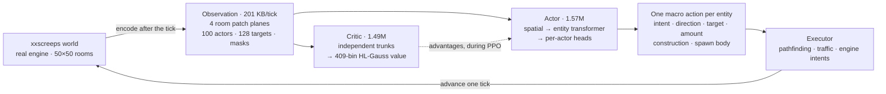
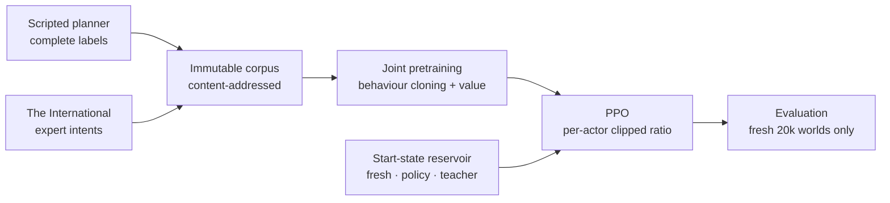

# Screeps RL

Reinforcement learning for [`xxscreeps`](../../README.md): one neural policy runs
an entire Screeps colony — every creep, spawn and tower — choosing one masked
macro action per entity, every tick.

It learns in two stages. First it clones two teachers: a scripted planner, and
[The International](https://github.com/The-International-Screeps-Bot/The-International-Open-Source),
one of the strongest open-source Screeps bots. Then PPO takes over against the
live simulator.

This is a research stack, not a competitive bot. What it does and does not do is
measured below.

## Cloning, then reinforcement

| After behaviour cloning | After PPO |
|---|---|
|  |  |
| Imitates the teachers' whole repertoire — it lays construction sites, builds, hauls, upgrades — but thinly. Sites are scattered over the room instead of clustered into a base, most are never finished, and the economy stays at RCL2 after 40,000 ticks. | Two sources saturated by ~30 creeps, energy recovered from the ground, a hauling lane to the controller, RCL3 in 7,600 ticks — and **no construction at all**. PPO kept everything that pays this tick and dropped everything that pays later. |

Both clips are 10 s of a full run recorded with
[`tools/record_showcase.py`](./tools/record_showcase.py).

## What it does

Best current policy, scored on ten **fresh, untouched** 20,000-tick worlds at a
seed used by neither training nor teacher collection. The score is
`harvested_energy + controller_progress` per tick, greedy decoding:

| Scenario | Score/tick | Behaviour |
|---|---:|---|
| `empty` — bare room, one spawn | **17.1** | Grows to ~30 creeps, saturates both sources, reaches RCL3 |
| `seed_creep` | **18.5** | Same, from a seeded worker |
| `seed_claimer` | **17.4** | Same, plus 2 room claims |
| `seed_full` | **13.1** | Operates an inherited mature colony |
| `seed_outpost` | **16.6** | Works a neutral outpost |

An otherwise identical PPO run that differed **only in which states it trained
from** scores 4.0. Closing that gap was a data-distribution change, not a bigger
network — see [start states](#start-states).

### What reinforcement gains, and what it loses

Intents issued per update, first ten updates (still near the cloned policy)
against the last forty:

| Behaviour | Early | Late | Change |
|---|---:|---:|---:|
| `upgradeController` | 16,090 | 42,134 | **2.6×** |
| `pickup` — recovering dropped energy | 5,245 | 12,600 | **2.4×** |
| `move` — deliberate repositioning | 107 | 5,118 | **48×** |
| `harvest` | 43,806 | 27,309 | 0.6× |
| `build` | 6,220 | 135 | **0.02×** |
| `createConstructionSite` | 47 | 12 | 0.3× |

And on the held-out evaluation, against the control run that saw only
tick-zero starts:

| | Reinforced | Control |
|---|---:|---:|
| Score per tick (sum over five scenarios) | **82.7** | 20.0 |
| Controller progress rate | **27.2** | 0.1 |
| Remote-room harvesting | **32,228** | 0 |
| Remote energy delivered home | **311** | 0 |
| Room claims | 2 | 0 |

So harvesting throughput, upgrading, energy recovery and remote work all improve
substantially, while construction is suppressed roughly 46× and claiming stays
rare. Fewer `harvest` intents with far more delivered energy is the same story
from the other side: less time re-deciding, more time working.

### Why building disappears

Nothing is broken — the objective says so. PPO optimizes
`0.1 × harvested + 1.0 × controller_progress` with `gamma = 0.995`, an effective
horizon of `1/(1-gamma) = 200` ticks. An extension costs thousands of energy now
and repays through cheaper bodies over thousands of ticks; a claim repays even
later. Discounted at 200 ticks, those are worth approximately nothing, while the
same energy spent on `upgradeController` scores immediately. Construction
survives only as low-probability policy mass — enough to appear under sampled
decoding, never enough to be the greedy action.

That horizon, and the 512-tick rollout it sits inside, were chosen so the whole
loop trains on **one GPU**: 512 ticks × 12 environments is 6,144 transitions per
update, about 16 s wall. Both are the most likely ceiling on further progress,
and neither is cheap to lift — longer rollouts cost collection time linearly, and
a longer horizon costs advantage variance. Candidate approaches are in
[`docs/ROADMAP.md`](./docs/ROADMAP.md).

**Also not yet demonstrated:** economy-funded expansion, sustained remote
logistics late in a lifecycle, and structure placement worth building. Greedy
evaluation hides behaviours that live in sampled mass, so every reported count
names its decode; see [`docs/DECISIONS.md`](./docs/DECISIONS.md).

## How it works



Every live creep, spawn and tower picks one goal-conditioned action per tick. The
executor turns it into engine intents and owns pathfinding and traffic, so the
network spends its capacity on decisions rather than on walking.

| Factor | Choices | Active when |
|---|---:|---|
| Intent | 20 | always |
| Direction | 8 | the intent is directional |
| Target | 128 candidates | the intent needs an object |
| Amount | 10 bins | the intent moves resources |
| Construction | 7 types × 2,500 tiles | room actors only |
| Spawn body | 8 part counts + learned part order | spawns only |

Inactive factors are masked out of the likelihood entirely, so they never enter
cloning, entropy or the PPO ratio. Coordination happens **within a tick**: there
is no temporal attention and no recurrent state, which is why long-lived tasks
are [roadmap](./docs/ROADMAP.md#temporal-memory-and-options) work.

## Training



- **Two teachers, different jobs.** The scripted planner supplies complete labels
  and the empty-room-to-expansion qualification target. The International plays
  far better, and its raw engine intents give exact conservative labels for
  targets, construction and spawn composition — but only where they map onto the
  macro ABI. Immediate moves and multi-command ticks are dropped rather than
  guessed.
- **Corpus first, training second.** Lifecycles are collected once into an
  immutable, content-addressed artifact with finite-horizon value targets
  computed up front. Training loads only that artifact and refuses a different
  one on resume, so a cloning result can always be traced to exact data.
- **PPO.** Likelihood ratios are clipped per live actor, averaged within a team
  state, then across transitions, so a 40-creep colony gets no more weight than a
  4-creep one. `lambda = 0.95`, advantages normalized once per rollout,
  time-limit terminals bootstrap value instead of silently truncating credit.
- **One optimizer for both stages.** Muon — Polar Express orthogonalization with
  NorMuon second-moment reweighting — on hidden transformer matrices, fused AdamW
  on embeddings and heads, no learning-rate schedule anywhere.
- **Objective.** `0.1 × harvest + 1.0 × controller_progress`, and nothing else.
  Delivery, construction, claims and spawning stay diagnostics and qualification
  gates: gross deltas are gameable, and a fixed claim bonus would swamp economic
  quality.

### Start states

Twelve environments all starting at tick zero advance in lockstep, so every
update draws from one narrow band of a 20,000-tick timeline. Behaviours that only
matter later — remote hauling, replacement, recovery — stop appearing in the
batch and get unlearned. The control run demonstrates it: its training reward
halved while entropy, gradient norm and KL all collapsed toward zero.

So PPO draws start states from an **event-stratified reservoir**:

- half the fleet stays on untouched full lifecycles, which are the only worlds
  whose late states follow from the policy's own earlier decisions;
- the rest resume from snapshots of recent policy runs, successful and failed;
- a temporary teacher lane bridges phases the policy cannot reach yet, and
  retires per phase once the policy supplies its own examples.

Snapshots are stratified by event, not sampled periodically — periodic sampling
overrepresents long boring plateaus. Captured events include pre-spawn and
pre-claim, outbound to a remote source, loaded and returning, replacement due,
and RCL transitions. **Pre-decision** capture is the point: resuming after the
teacher chose a body and placed a structure would train execution of a decision
the policy never made, so the snapshot leaves the decision open and the policy
picks its own body and placement.


*Two PPO runs from the same cloned checkpoint, seed, optimizer and update count,
differing only in start states. Both inherit a working ~50-creep colony from
cloning; the tick-zero run loses it by update 60 and never recovers, and its
score settles at 4 while the reservoir run climbs past 15. Evaluation on fresh
worlds confirms it: **17.1 against 4.0**.*

Evaluation never uses snapshots — a policy scored from restored states is never
required to reach them. Contract:
[`docs/TRAINING.md`](./docs/TRAINING.md#start-states).

## Under the hood

The parts that were least obvious to get right.

**Spawn bodies in one pass.** A body is up to 50 parts drawn from 8 types, which
is far too large to enumerate and awkward to decode sequentially. Instead one
neural pass emits count logits for all eight types, then a fixed conditional scan
masks them so every sampled composition is non-empty, at most 50 parts, and
affordable at the room's current energy. A Plackett–Luce head then orders only
the part types with non-zero counts; zero-count types take a canonical suffix, so
one executed body has exactly one encoding. No length choice, no 50-step
decoder, no energy reservation across ticks.

**Macro actions, not keystrokes.** A learned action is a goal — harvest that
source, transfer to that structure, claim that controller — and the executor
performs one navigation or work step toward it, with traffic-aware movement and
cached routes. Routes are cached across ticks and reused for ten ticks, and
searches are bounded. The policy still reselects its goal every tick, so it can
abandon a plan, but it never spends learned capacity on eight direction classes
per step.

**Legality is part of the action.** Candidate masks, model compatibility,
executor validation and engine behaviour all describe the same executable
action. A legal intent with no executable argument is not offered at all, which
is why invalid actions are rare enough to report as a defect rather than a rate
(2 in 344,078 in the recorded run).

**Distributional value.** The critic predicts a 409-bin HL-Gauss distribution
over a signed-log return support rather than regressing a scalar, because
returns here span several orders of magnitude between an empty room and a mature
colony. Targets outside the support fail loudly instead of being clipped.

**Post-tick observations.** The server applies actions, advances the simulator,
then encodes — so the next decision sees the consequences of the last one.
Terminal observations are preserved for value bootstrap and trajectory chains are
cut at truncation.

Throughput, for context: an update is 512 ticks × 12 environments stepped in
parallel, then 12 optimizer steps, about 16 s on one RTX 5090 with collection at
7.7 s of it. `--compile` CUDA-graphs the per-tick forward and makes collection
1.7× faster; two other compile configurations were measured and rejected on
memory. See [`docs/PERFORMANCE.md`](./docs/PERFORMANCE.md).

## Run it

Requires Python 3.10+, Node 22+, PyTorch, NumPy, TensorBoard. Local training and
GPU evaluation go through `mlq`; `runs/` is gitignored, so a clean clone must
produce its own artifacts.

```bash
export RL_NODE="$(mise exec node@24 -- which node)"

# Contracts: model, action ABI, reward, teacher, environment
python3 -m samples.rl.agent.test_latent_unit
python3 -m samples.rl.agent.eval_scripted --ticks 20000 --max-episode 20000 --seed 3
python3 -m samples.rl.agent.eval_reward_contract
```

Watch a policy play, live in the Screeps client or as a 2K recording:

```bash
python3 -m samples.rl.agent.watch \
  --checkpoint samples/rl/runs/policy.pt --headful --deterministic --ticks 20000
# then open http://127.0.0.1:21025

python3 samples/rl/tools/record_showcase.py \
  --checkpoint samples/rl/runs/policy.pt \
  --out samples/rl/runs/showcase/run --ticks 40000
```

Train in three queued stages:

```bash
# 1. Collect the corpus once; it prints a content-addressed path
mlq submit --name screeps-corpus --priority 10 --max-parallel-runs 1 --cwd "$PWD" -- \
  python3 -m samples.rl.agent.pretrain_corpus \
    --num-envs 32 --steps 20000 --max-episode 20000 \
    --curriculum empty,seed_creep,seed_full,seed_claimer,seed_outpost \
    --ti-actor-steps 20000 --output samples/rl/runs/pretrain-corpora

# 2. Clone behaviour and value from it
mlq submit --name screeps-pretrain --max-parallel-runs 1 --cwd "$PWD" -- \
  python3 -m samples.rl.agent.pretrain_joint \
    --corpus samples/rl/runs/pretrain-corpora/<sha256> \
    --global-epochs 16 --seed 3 --device cuda \
    --save samples/rl/runs/joint_pretrain.pt

# 3. PPO from the reservoir, then score on fresh worlds
mlq submit --name screeps-ppo --max-parallel-runs 1 --cwd "$PWD" -- \
  python3 -m samples.rl.agent.train \
    --resume samples/rl/runs/joint_pretrain.pt --save samples/rl/runs/policy.pt \
    --device cuda --compile --seed 3 \
    --num-envs 12 --steps 512 --minibatch 1536 --max-episode 20000 \
    --curriculum empty,seed_creep,seed_full,seed_claimer,seed_outpost \
    --reservoir samples/rl/runs/reservoirs/run \
    --start-mix fresh=6,policy=4,teacher=2 --segment-ticks 2048

mlq submit --name screeps-eval --max-parallel-runs 1 --cwd "$PWD" -- \
  python3 -m samples.rl.agent.eval_closed_loop \
    --checkpoint samples/rl/runs/policy.pt --ticks 20000 --num-envs 10 --seed 900
```

Teacher snapshots for the reservoir's bridge lane are collected once with
`samples.rl.agent.teacher_snapshots`. A PPO resume restores weights, both
optimizers, reward normalization, counters and RNG state; environments restart,
so it continues the optimization rather than the trajectories.

## Layout

```text
samples/rl/
  schema.json   # capacities, action ABI, model and PPO configuration
  env/          # simulator server, encoder, executor, scripted teacher
  agent/        # model, PPO, optimizer, reservoir, training, evaluation
  tools/        # showcase recorder
  docs/         # architecture, training gates, performance, decisions, roadmap
  runs/         # local checkpoints, metrics, videos (gitignored)
```

| Document | Contents |
|---|---|
| [`docs/ARCHITECTURE.md`](./docs/ARCHITECTURE.md) | Implemented model and environment contract |
| [`docs/TRAINING.md`](./docs/TRAINING.md) | Executable training, qualification and evaluation gates |
| [`docs/PERFORMANCE.md`](./docs/PERFORMANCE.md) | Measured bottlenecks, transport, compilation |
| [`docs/DECISIONS.md`](./docs/DECISIONS.md) | Conclusions that should outlive individual experiments |
| [`docs/ROADMAP.md`](./docs/ROADMAP.md) | Open blockers and unresolved experiments |
