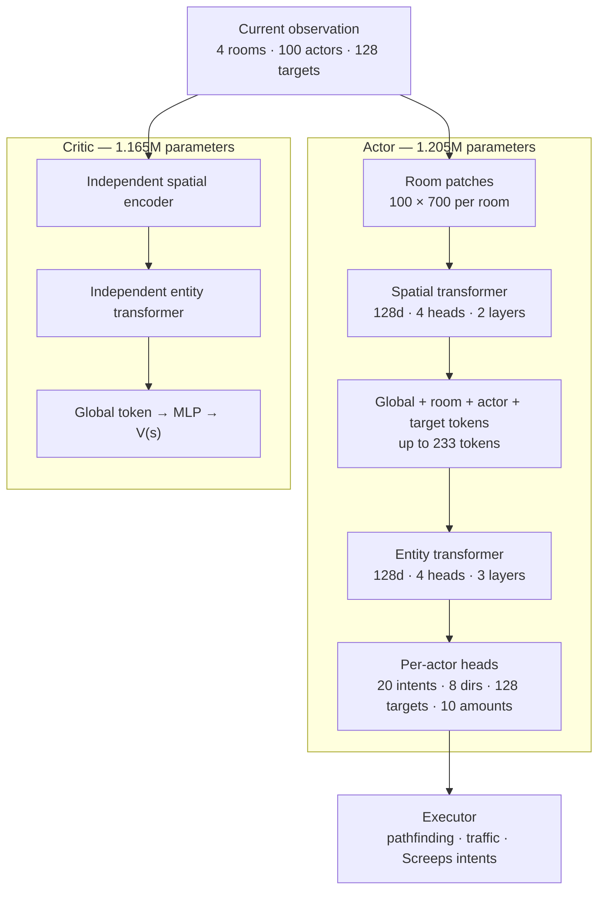

# Screeps RL

Entity-centric control for `xxscreeps`: a coordinated actor, centralized
entity-aware critic, masked macro actions, joint behavior-cloning/value
pretraining, and per-actor PPO.

This is an experimental research stack, not a production Screeps bot. The
current learned policy controls a small economy and materially benefits from
PPO; see the architecture document for readiness limits and planned work.

## Current evidence

Results below use the fixed `W7N3` empty-room scenario, seed 0, 6,000 ticks, and
the shaped training return printed by `watch`. They are not multi-seed results
or the raw harvest-plus-control score.

| Policy | Decoding | Shaped return | Outcome |
|---|---:|---:|---|
| Joint BC checkpoint | sampled | 6,372.3 | RCL2, controller 187 |
| Joint BC checkpoint | deterministic | 5,224.4 | RCL1, controller 0 |
| PPO checkpoint | sampled | **8,315.0** | RCL2, controller 4,010 |
| PPO checkpoint | deterministic | 5,187.2 | RCL1, controller 0 |

PPO improved the matched sampled evaluation by **30.5%**. Deterministic
behavior did not improve, so useful upgrading behavior still lives in sampled
policy mass rather than the modal action.

Current workspace artifacts:

- `runs/joint_pretrain_highreward10m.pt`: joint BC/value pretraining; complete
  artifact, but promoted with intentionally relaxed experimental thresholds.
- `runs/policy_highreward_ppo10m.pt`: 55 PPO updates, 112,640 environment
  steps, complete optimizers/reward statistics/RNG state, schema-compatible.

Neither is release-qualified. Current evaluation covers one map and one action
seed; detailed limitations and next gates live in
[`docs/17-SCALABLE-ENTITY-MAPPO.md`](./docs/17-SCALABLE-ENTITY-MAPPO.md).

## Model

| Network | Parameters | Role |
|---|---:|---|
| Actor | **1,205,478** | Coordinated entity policy |
| Critic | **1,164,737** | Centralized value model |
| Total | **2,370,215** | Separate, unshared networks |



Each trunk has 1,131,584 parameters. The actor adds 73,894 action-head
parameters; the critic adds a 33,153-parameter value head. Deployment only
needs the actor unless value estimates are required.

The transformer coordinates entities within the current tick; it has no
temporal attention or learned recurrent state. Temporal-memory design belongs
to the [architecture roadmap](./docs/17-SCALABLE-ENTITY-MAPPO.md).

## Observation and action contracts

Per environment:

| Field | Shape | Meaning |
|---|---:|---|
| `patches` | `[4,100,700]` uint8 | Four room slots; 5×5 spatial patches |
| `room_coords` | `[4,2]` | Stable room-world offsets |
| `actors` | `[100,28]` | Up to 64 creeps plus 36 spawn/tower actors |
| `targets` | `[128,24]` | Typed sources, structures, creeps, resources, sites, and positions |
| `globals` | `[12]` | Economy, counts, and overflow signals |

The default transport is framed binary IPC; base64-packed and JSON modes exist
for debugging. Encoding lives in [`env/encode.mjs`](./env/encode.mjs).

Every live actor chooses one goal-conditioned intent per tick:

- intent: 20 classes;
- direction: 8 classes when used;
- target: contextual pointer over 128 candidates when used;
- amount/body/site type: 10 classes when used.

Masks close inactive factors and illegal candidates. Targeted intents execute a
single navigation or work step through [`env/actions.mjs`](./env/actions.mjs),
which provides traffic-aware movement and cached paths. The policy must still
reselect its goal every tick.

## Learning contract

- Joint pretraining uses the same scripted `(state, action, reward)` stream for
  actor BC and critic return regression.
- PPO clips likelihood ratios per live actor, averages actors within a team
  state, then averages transitions. Larger colonies do not receive extra sample
  weight merely for having more creeps.
- Actor arguments are type-gated; unused direction/target/amount factors do not
  enter BC, entropy, or PPO likelihoods.
- `gamma=0.999`; policy GAE `lambda=0.97`; critic targets use `lambda=1`.
- Advantages are normalized once over the rollout.
- Time-limit terminals bootstrap value and cut trajectory chains.
- Training uses a productive-economy shaped reward:

```text
r_train = 0.1·harvest + 0.25·productive_delivery + 0.5·build_progress
          + 1.0·control + 500·newly_claimed_room
```

`watch` reports this shaped return. Raw evaluation score is
`harvest + control`; the current watcher does not yet aggregate it separately.
Delivery reward only counts energy entering spawn, extensions, or towers;
withdrawal is limited to storage/container/link so transfer-withdraw cycling
cannot mint reward.

## Run it

Requirements: Python 3.10+, Node 22+, PyTorch, NumPy, and TensorBoard.

```bash
export RL_NODE="$(mise exec node@24 -- which node)"

# Contracts
python3 -m samples.rl.agent.test_latent_unit
python3 -m samples.rl.agent.eval_scripted --ticks 6000 --max-episode 6000
python3 -m samples.rl.agent.eval_expansion --ticks 500
python3 -m samples.rl.agent.eval_reward_contract

# Workspace-local checkpoint example; runs/ is gitignored.
# CPU inference does not reserve the shared GPU.
python3 -m samples.rl.agent.watch \
  --checkpoint samples/rl/runs/policy_highreward_ppo10m.pt \
  --device cpu --sample --headful --tick-ms 30 --ticks 6000 --no-compile
```

The checkpoint examples above and below refer to artifacts in this working
copy; a clean clone must generate or supply compatible artifacts first. Queue
all local training and GPU evaluation through `mlq`. Use eager PPO for now: the
compiled update graph hit a demonstrated TorchInductor target-index assertion,
while the equivalent eager run completed successfully.

```bash
mlq submit --name screeps-ppo --max-parallel-runs 1 --cwd "$PWD" -- \
  python3 -m samples.rl.agent.train \
    --resume samples/rl/runs/policy_highreward_ppo10m.pt \
    --save samples/rl/runs/policy_next.pt \
    --device cuda --no-compile \
    --steps 512 --max-rollout-steps 512 --max-episode 6000 \
    --num-envs 8 --curriculum empty,seed_creep,seed_full,seed_claimer
```

A PPO resume restores actor, critic, both optimizers, aggregate reward
normalization, counters, and CPU/CUDA/NumPy RNG state. Environments restart, so
it is an optimizer/weights continuation rather than a continuation of live
trajectories.

## Layout and documentation

```text
samples/rl/
  schema.json   # capacities, action ABI, model and PPO configuration
  env/          # simulator server, encoder, executor, scripted teacher
  agent/        # model, PPO, GAE, buffers, training, evaluation, watcher
  docs/         # architecture, training gates, reward and performance contracts
  runs/         # local checkpoints and metrics
```

Further documentation:

- [`docs/17-SCALABLE-ENTITY-MAPPO.md`](./docs/17-SCALABLE-ENTITY-MAPPO.md)
- [`docs/11-REWARD-AND-PRETRAIN.md`](./docs/11-REWARD-AND-PRETRAIN.md)
- [`docs/13-PERFORMANCE.md`](./docs/13-PERFORMANCE.md)

Other numbered wave/session documents are historical and must not be used to
launch current schema-v2 training.
