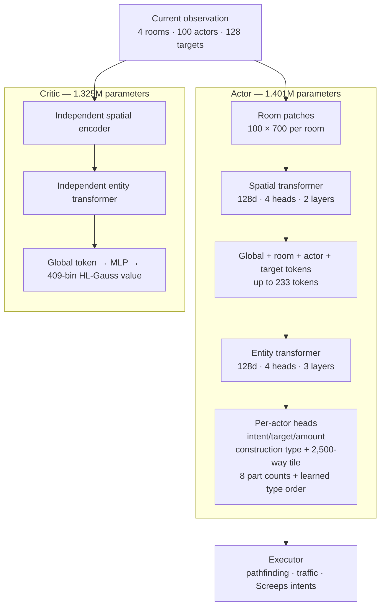

# Screeps RL

Entity-centric control for `xxscreeps`: a coordinated actor, centralized
entity-aware critic, masked macro actions, joint behavior-cloning/value
pretraining, and per-actor PPO.

This is an experimental research stack, not a production Screeps bot. The
historical policy controlled a small economy and materially benefited from PPO.
The current ABI requires fresh pretraining before another PPO run.

The International is the strongest expert trajectory source: on the fixed
1,000-tick contract it reaches roughly 9–20 raw harvest+control per tick across
tested seeds, with much higher post-warmup throughput. Raw engine intents supply
exact conservative target, construction, and spawn-composition labels. Spawn
ordering is supervised only when the raw body is representable as contiguous
part-type blocks; immediate moves and other commands that do not fit the
one-slot macro ABI are rejected. A scripted planner remains
the complete-label and empty-to-expansion qualification teacher.

## Current evidence

Results below use the fixed `W7N3` empty-room scenario, seed 0, 6,000 ticks, and
the old reward ABI used by those historical checkpoints. They are not
multi-seed results or comparable to new H+C-only checkpoints.

| Policy | Decoding | Historical return | Outcome |
|---|---:|---:|---|
| Joint BC checkpoint | sampled | 6,372.3 | RCL2, controller 187 |
| Joint BC checkpoint | deterministic | 5,224.4 | RCL1, controller 0 |
| PPO checkpoint | sampled | **8,315.0** | RCL2, controller 4,010 |
| PPO checkpoint | deterministic | 5,187.2 | RCL1, controller 0 |

PPO improved the matched sampled evaluation by **30.5%**. Deterministic
behavior did not improve, so useful upgrading behavior still lives in sampled
policy mass rather than the modal action.

Historical workspace artifacts:

- `runs/joint_pretrain_highreward10m.pt`: joint BC/value pretraining promoted
  with intentionally relaxed experimental thresholds.
- `runs/policy_highreward_ppo10m.pt`: 55 PPO updates and 112,640 environment
  steps.

Both predate the free-form body, entity-outcome, H+C reward, and HL-Gauss ABIs and
are intentionally rejected by the current loader. Neither is release-qualified.
Current evaluation covers one map and one action seed; detailed limitations live in
[`docs/ROADMAP.md`](./docs/ROADMAP.md).

## Model

| Network | Parameters | Role |
|---|---:|---|
| Actor | **1,400,998** | Coordinated entity and room-strategy policy |
| Critic | **1,324,889** | Centralized HL-Gauss value model |
| Total | **2,725,887** | Separate, unshared networks |



Each trunk has 1,239,104 parameters. The actor adds 161,894 action-head
parameters; the critic adds an 85,785-parameter value head. Deployment only
needs the actor unless value estimates are required.

The transformer coordinates entities within the current tick; it has no
temporal attention or learned recurrent state. Temporal-memory design belongs
to the [roadmap](./docs/ROADMAP.md).

## Observation and action contracts

Per environment:

| Field | Shape | Meaning |
|---|---:|---|
| `patches` | `[4,100,700]` uint8 | Four room slots; 5×5 spatial patches |
| `room_coords` | `[4,2]` | Stable room-world offsets |
| `actors` | `[100,36]` | Exact total/active body counts plus store, health, fatigue, TTL, spawning, position, and room-energy state |
| `actor_outcome` | `[100]` uint8 | Previous tick's categorical result for this stable entity |
| `targets` | `[128,24]` | Typed sources, structures, creeps, resources, and sites |
| `construction_mask` | `[4,7,313]` uint8 | Bit-packed authoritative legality for every room/type/tile |
| `globals` | `[12]` | Economy, counts, and overflow signals |

The default transport is framed binary IPC; base64-packed and JSON modes exist
for debugging. Encoding lives in [`env/encode.mjs`](./env/encode.mjs).

Every live actor chooses one goal-conditioned intent per tick:

- intent: 20 classes;
- direction: 8 classes when used;
- target: contextual pointer over 128 candidates when used;
- amount: 10 classes when used;
- construction: 7 structure types followed by one 2,500-tile categorical, only on room actors;
- spawn body: eight part counts (0–50) plus a learned order over the nonzero part types.

Body logits are produced in one neural pass. A fixed eight-type conditional scan
masks counts so the sampled composition is nonempty, has at most 50 parts, and
fits current room energy. A Plackett–Luce head orders only the part types whose
counts are nonzero; zero-count types use a canonical suffix, avoiding duplicate
encodings of the same executed body. There is no separate length choice, no
50-token decoder, and no energy reservation across ticks.
Masks close inactive factors and illegal candidates. Targeted intents execute a
single navigation or work step through [`env/actions.mjs`](./env/actions.mjs),
which provides traffic-aware movement and cached paths. The policy must still
reselect its goal every tick.

## Learning contract

- The standalone corpus collector records full scripted and TI lifecycles,
  computes exact finite-horizon returns once, and writes an immutable,
  content-addressed artifact. Joint pretraining only loads that artifact and
  globally shuffles its stage-balanced reservoirs. Scripted rows provide
  complete actor BC and critic targets; TI contributes exact, macro-compatible
  actor factors plus a one-time critic initialization set. Raw movement and
  unsupported or concurrent TI commands are never guessed as actor labels.
  Because value is behavior-policy dependent, repeated TI value fitting never
  competes with the final scripted-policy critic: promotion uses the independent
  scripted holdout, while post-adaptation TI EV is diagnostic. A trainer-side
  actor-only auxiliary lane reindexes rare `createConstructionSite` and
  `claimController` actors. It scores intent+structure type for construction
  (not the teacher's arbitrary legal tile) and intent+target for claims.
- PPO clips likelihood ratios per live actor, averages actors within a team
  state, then averages transitions. Larger colonies do not receive extra sample
  weight merely for having more creeps.
- Actor arguments are type-gated; unused direction/target/amount factors do not
  enter BC, entropy, or PPO likelihoods.
- PPO uses `gamma=0.995` and one CleanRL-style GAE recurrence with
  `lambda=0.95`: actor advantages come from GAE and critic targets are exactly
  `advantage + behavior_value`. The geometric decay is `0.94525`, an effective
  horizon of about 18 steps. Critic pretraining uses finite-horizon discounted
  reward-to-go at the same gamma; actor pretraining is supervised BC and has no GAE.
- Advantages are normalized once over the rollout.
- Time-limit terminals bootstrap value and cut trajectory chains.
- Supervised pretraining runs on CUDA with Muon (`lr=0.01`) on hidden
  transformer matrices and AdamW on embeddings/heads. Muon alone uses `0.025`
  cautious update-agreement decay; PPO remains fused AdamW with zero decay.
- Training optimizes harvest and controller progress only:

```text
r_train = 0.1·harvest + 1.0·control
```

Delivery, construction, claims, spawning, and storage flows remain diagnostics
and qualification gates because their gross deltas are proxy-gameable. The raw
comparison score is `harvest + control`; the current watcher does not yet
aggregate it separately.

## Run it

Requirements: Python 3.10+, Node 22+, PyTorch, NumPy, and TensorBoard.

```bash
export RL_NODE="$(mise exec node@24 -- which node)"

# Contracts
python3 -m samples.rl.agent.test_latent_unit
python3 -m samples.rl.agent.eval_scripted --ticks 20000 --max-episode 20000 --seed 3
python3 -m samples.rl.agent.eval_expansion --ticks 500
python3 -m samples.rl.agent.eval_reward_contract

# Workspace-local checkpoint example; runs/ is gitignored.
# CPU inference does not reserve the shared GPU.
python3 -m samples.rl.agent.watch \
  --checkpoint samples/rl/runs/policy_v2.pt \
  --device cpu --sample --headful --tick-ms 30 --ticks 6000 --no-compile
```

The checkpoint examples above and below refer to artifacts in this working
copy; a clean clone must generate or supply compatible artifacts first. Queue
all local training and GPU evaluation through `mlq`. Use eager PPO for now: the
compiled update graph hit a demonstrated TorchInductor target-index assertion,
while the equivalent eager run completed successfully.

```bash
mlq submit --name screeps-pretrain-corpus --priority 10 \
  --max-parallel-runs 1 --cwd "$PWD" -- \
  python3 -m samples.rl.agent.pretrain_corpus \
    --num-envs 32 --steps 20000 --max-episode 20000 \
    --curriculum empty,seed_creep,seed_full,seed_claimer,seed_outpost \
    --ti-actor-steps 20000 --ti-replay-capacity 8192 \
    --output samples/rl/runs/pretrain-corpora
```

After that job succeeds, inspect its printed content-addressed path and submit
training explicitly:

```bash
CORPUS=samples/rl/runs/pretrain-corpora/<corpus-sha256>

mlq submit --name screeps-joint-pretrain --max-parallel-runs 1 --cwd "$PWD" -- \
  python3 -m samples.rl.agent.pretrain_joint \
    --corpus "$CORPUS" \
    --global-epochs 16 --seed 3 --device cuda \
    --save samples/rl/runs/joint_pretrain_v4.pt

mlq submit --name screeps-teacher-start-states --priority 10 \
  --max-parallel-runs 1 --cwd "$PWD" -- \
  python3 -m samples.rl.agent.teacher_snapshots \
    --teacher ti --num-envs 4 --steps 20000 \
    --curriculum empty,seed_outpost \
    --output samples/rl/runs/teacher-start-states

mlq submit --name screeps-ppo --max-parallel-runs 1 --cwd "$PWD" -- \
  python3 -m samples.rl.agent.train \
    --resume samples/rl/runs/joint_pretrain_v4.pt \
    --save samples/rl/runs/policy_next.pt \
    --device cuda --no-compile \
    --steps 512 --max-rollout-steps 512 --max-episode 20000 --seed 3 \
    --num-envs 24 --minibatch 1536 \
    --curriculum empty,seed_creep,seed_full,seed_claimer,seed_outpost \
    --start-mix fresh=12,policy=8,teacher=4 \
    --reservoir samples/rl/runs/reservoirs/next \
    --teacher-start-states samples/rl/runs/teacher-start-states/<sha256> \
    --segment-ticks 2048
```

A PPO resume restores actor, critic, both optimizers, aggregate reward
normalization, counters, and CPU/CUDA/NumPy RNG state. Environments restart, so
it is an optimizer/weights continuation rather than a continuation of live
trajectories.

PPO draws its start states from an event-stratified reservoir instead of always
beginning at tick zero. Twelve of the 24 environments stay untouched
full-lifecycle worlds, the rest resume from policy and teacher snapshots, and
evaluation remains on fresh 20,000-tick worlds. The contract, including the
one-off teacher collection above, is in
[`docs/TRAINING.md`](./docs/TRAINING.md#start-states).

## Layout and documentation

```text
samples/rl/
  schema.json   # capacities, action ABI, model and PPO configuration
  env/          # simulator server, encoder, executor, scripted teacher
  agent/        # model, PPO, GAE, buffers, training, evaluation, watcher
  docs/         # architecture, training gates, reward and performance contracts
  runs/         # local checkpoints and metrics
```

Further documentation:

- [`docs/ARCHITECTURE.md`](./docs/ARCHITECTURE.md) — implemented model and environment contract
- [`docs/TRAINING.md`](./docs/TRAINING.md) — executable training, qualification, evaluation, and stop gates
- [`docs/PERFORMANCE.md`](./docs/PERFORMANCE.md) — transport, storage, compilation, and profiling contracts
- [`docs/ROADMAP.md`](./docs/ROADMAP.md) — unresolved blockers and measured architectural experiments
- [`docs/DECISIONS.md`](./docs/DECISIONS.md) — durable conclusions and evidence distilled from expert reviews
