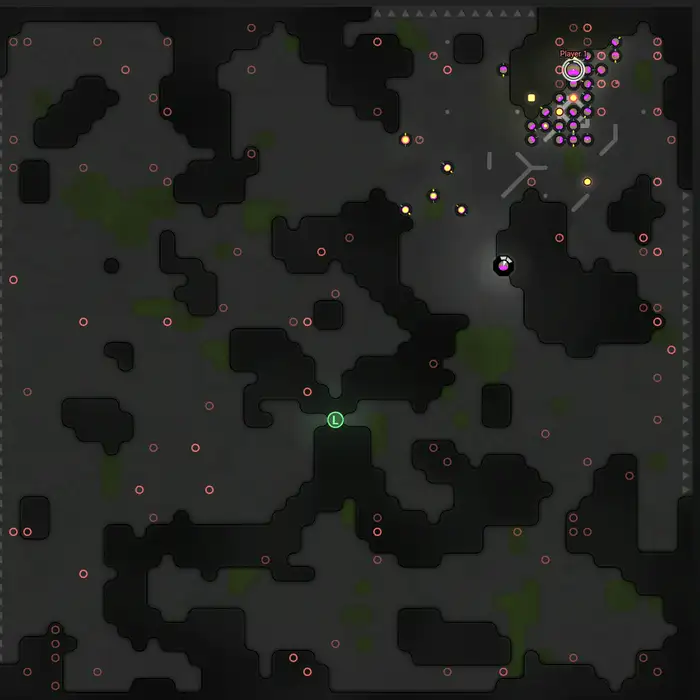
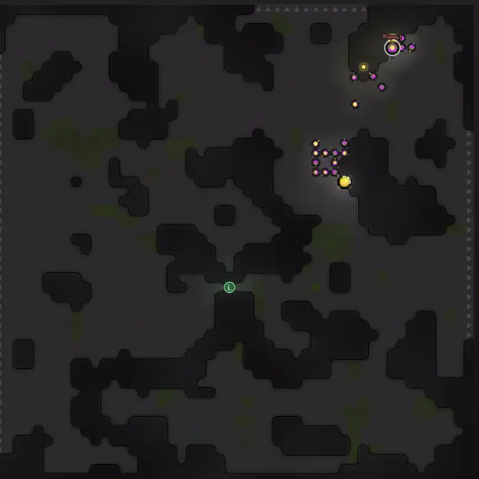
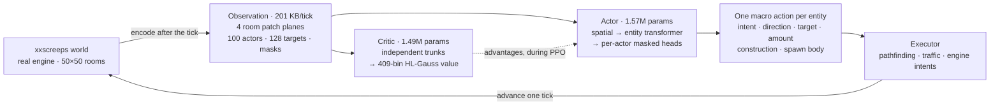
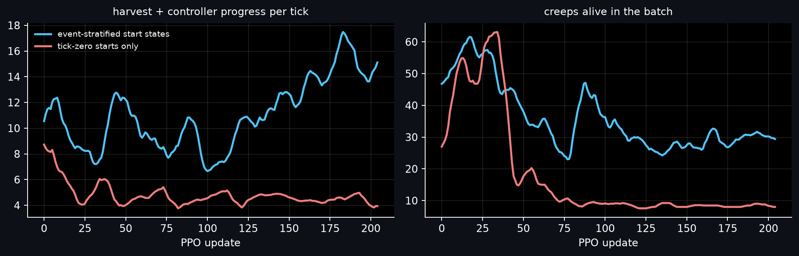
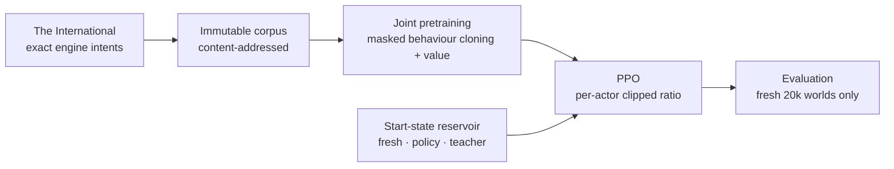

# Screeps RL

Reinforcement learning for [`xxscreeps`](../../README.md). One neural policy runs a
whole Screeps colony, emitting one masked macro action for every live creep, spawn
and tower on every simulator tick. It is cloned from [The
International](https://github.com/The-International-Screeps-Bot/The-International-Open-Source)
playing inside the engine, then trained with PPO against the live simulator. The
1,566,118-parameter actor is the only network needed to play, and a
1,490,009-parameter critic trains alongside it. A research stack rather than a
competitive bot.

## What it does

| Cloned from the teacher | After PPO |
|:---:|:---:|
| [](https://youtu.be/MSGC9j2Smok) | [](https://youtu.be/rFsW3197xaY) |

Twelve-second excerpts from two full runs, recorded with
[`tools/record_showcase.py`](./tools/record_showcase.py); each clip links to its
complete run. The cloned policy on the left reproduces the teacher's whole
repertoire and spreads itself thin doing it: about 33 creeps working while
construction sites sit unfinished across the room instead of clustered into a base,
still RCL2 after 40,000 ticks. The reinforced policy on the right runs about 30 creeps with both sources
saturated and a hauling lane to the controller, reaching RCL3 in 7,600 ticks and
placing no construction sites under greedy decoding.

Scores come from ten fresh, untouched 20,000-tick worlds at seed 900, used by
neither training nor teacher collection, decoded greedily. The quantity scored is
`harvested_energy + controller_progress` per tick. Every measurement and clip in
this document predates both the current objective described below and the move to a
single teacher: the policy shown was cloned from the hand-written planner plus The
International, and a rerun from the real teacher alone is in progress.

| Scenario | Score/tick |
|---|---:|
| `empty`, one spawn in a bare room | 17.1 |
| `seed_creep`, one seeded worker | 18.5 |
| `seed_claimer`, plus 2 room claims | 17.4 |
| `seed_full`, an inherited mature colony | 13.1 |
| `seed_outpost`, a neutral outpost | 16.6 |

## Design



A Screeps tick is not one decision: a forty-creep colony plus its spawn and towers
presents forty-odd simultaneous choices, each from a legal set that changes every
tick. Each design below takes one part of that problem.

### Macro actions and a deterministic executor

Driving a creep through the engine API means picking one of eight directions on
every tick of a walk lasting hundreds of ticks, so the network spends capacity
rediscovering pathfinding a search does better while credit assignment drowns in
steps of no strategic content. A learned action is therefore a goal: harvest that
source, transfer to that structure, claim that controller. The executor takes one
navigation or work step toward it per tick, with traffic-aware movement and routes
cached for ten ticks under bounded searches, and the policy reselects its goal every
tick, so it can abandon a route halfway. One action is a handful of factors, each
active only when the chosen intent needs it, and inactive factors are masked out of
the likelihood, so they never enter cloning, entropy or the PPO ratio.

| Factor | Choices | Active when |
|---|---:|---|
| Intent | 20 | always |
| Direction | 8 | the intent is directional |
| Target | 128 candidates | the intent needs an object |
| Amount | 10 bins | the intent moves resources |
| Construction | 7 types x 2,500 tiles | room actors only |
| Spawn body | 8 part counts plus a learned part order | spawns only |

### Spawn bodies without a sequence decoder

A body is up to 50 parts drawn from 8 types and the engine cares about their order,
which as a sequence means a 50-step decoder plus a length decision over a space
where many sequences denote the same creep. Instead one neural pass emits count
logits for all eight types, a fixed conditional scan masks them so every sampled
composition is non-empty, at most 50 parts and affordable at current room energy,
and a Plackett-Luce head orders only the non-zero types while the rest take a
canonical suffix. One executed body then has one encoding and one exact likelihood,
with no length action, no 50-step decoder and no cross-tick energy reservation.

### Legality as part of the action definition

Legality moves every tick: a transfer is legal until the target fills, a claim until
the control level caps out, a tile until something occupies it, and a policy free to
emit illegal intents learns from a signal shaped by its own bookkeeping errors. So
the action space admits only executable actions: candidate masks, model
compatibility, executor validation and engine behaviour describe the same action, a
legal intent with no executable argument is never offered, and construction draws
its tile from the engine validator's own bit-packed support. An invalid action is
then a defect to report, at 2 out of 344,078 in a recorded 40,000-tick run.

### Seeing the tick that just happened, and valuing it

Encoding the world before the engine applies intents would leave every decision
acting on a state one tick stale, with the previous action's outcome invisible.
Observations are therefore encoded after the tick is applied: 201 KB per tick, four
room slots of 100 patches by 700 values, 100 actor rows, 128 target candidates and
the legality masks. Terminal observations are retained so value can bootstrap
through them and chains are cut at truncation, so a rollout ending on its time limit
does not truncate credit. All coordination happens inside a tick, with no recurrent
state, so long-lived tasks are
[roadmap](./docs/ROADMAP.md#temporal-memory-and-options) work.

Returns span orders of magnitude, since an empty room and a mature colony are not
the same regression problem and a scalar head spends its accuracy on whatever
magnitudes dominate the batch. The critic instead predicts a 409-bin HL-Gauss
distribution over a signed-log support and decodes an expectation for bootstrapping,
with targets outside the support failing loudly instead of being clipped into range.

### Start states drawn from a reservoir

Twelve environments that all begin at tick zero advance in lockstep, so each update
draws from one narrow band of a 20,000-tick timeline, and behaviour that only
matters later, such as remote hauling, stops appearing and is unlearned.



Two PPO runs share a cloned checkpoint, seed, optimizer and code fingerprint and
both stop at update 204 and global step 1,259,520, differing only in their start
states; both inherit a roughly 50-creep colony from cloning. The tick-zero-only run
falls to 8 creeps by update 60 and settles at a score near 4, while the reservoir
run holds 27 to 35 creeps and climbs past 15. Held-out evaluation, summed over the
five scenarios above, agrees:

| | Reservoir | Tick-zero only |
|---|---:|---:|
| Score per tick | 82.7 | 20.0 |
| Controller progress rate | 27.2 | 0.1 |
| Remote-room harvesting | 32,228 | 0 |
| Remote energy delivered home | 311 | 0 |
| Room claims | 2 | 0 |

PPO therefore draws start states from an event-stratified reservoir across its
twelve environments, split `fresh=6, policy=4, teacher=2` in segments of 2,048
ticks. Half the fleet stays on untouched full lifecycles, the only worlds whose late
states follow from the policy's own earlier decisions; the rest resume from
snapshots of recent policy runs, successful and failed, while a temporary teacher
lane bridges phases the policy cannot reach yet and retires per phase.

Snapshots are stratified by event rather than sampled periodically, since periodic
sampling overrepresents long plateaus. Capture happens before a decision as well as
after, so a resumed policy chooses its own body and placement rather than executing
a teacher's committed choice. Evaluation never uses snapshots, since a policy scored
from restored states is never required to reach them; the contract is in
[`docs/TRAINING.md`](./docs/TRAINING.md#start-states).

### One optimizer, and compiling only the path that pays

Two stages with different optimizers make the handoff between them a change of
update geometry as well as of objective. Both stages therefore share one optimizer:
Muon with Polar Express orthogonalization and NorMuon second-moment reweighting on
the hidden transformer matrices, fused AdamW on embeddings and heads, and no
learning-rate schedule. PPO's Muon rate is RMS-matched to the AdamW step it
replaces, so adopting it changes update geometry rather than step size.

A 512-tick update across 12 environments stepped in parallel, followed by 12
optimizer steps, took about 16 seconds on one RTX 5090 with 7.7 seconds of that in
collection, and collection is thousands of small launch-bound calls, one per
simulated tick at batch 12. `--compile` therefore CUDA-graphs the per-tick forward
and leaves the minibatch path eager, raising collection from about 531 to about 876
environment steps per second, roughly 1.7x. A capture pool at minibatch 1536 needed
about 28.5 GB and did not fit, which is what keeps that half eager;
[`docs/PERFORMANCE.md`](./docs/PERFORMANCE.md) has the measurements.

## Training



There is one teacher, and it is a real bot. [The
International](https://github.com/CarsonBurke/The-International-Open-Source) plays
the game inside the engine, and the harness captures its raw intent payload at the
runner boundary, translates the exactly representable intents into the macro action
ABI, and marks per-factor which of them are supervised. 83.8% of its measured
decisions are representable; immediate moves are held and retro-labelled to the
harvest, transfer or claim they served, while multi-command ticks and amounts
outside our bins are dropped with a named counter instead of guessed. A label whose
target, amount or construction tile is not in that tick's candidate mask is dropped
too, rather than admitted by widening the mask.

The hand-written planner in
[`env/scripted_baseline.mjs`](./env/scripted_baseline.mjs) is now only a baseline to
beat. It emits the same macro action format, so it can be scored against the policy
on the same worlds, but a teacher we authored ourselves teaches the policy our own
guesses about roles, bodies and placement, and every gate built on those guesses
then certifies agreement with the guess. It supplies no training label.

A real bot can also stop playing: The International aborts a whole tick when a
memory segment it expects is missing, load-sensitively, so two runs of one seed
produced 660 and 2 labels with identical bot logs. Collection therefore grades
liveness. A healthy 3,000-tick episode acts on 2,974 ticks with a worst silence of
12 ticks while the opening creep spawns, so an episode that goes 30 graded ticks
without an intent, or acts on under half of them, fails closed and the persisted
corpus carries the record. Corpus lifecycles are collected once into an immutable,
content-addressed artifact, and training refuses a different corpus on resume.

PPO clips a likelihood ratio per live actor and normalizes the loss per actor
decision rather than per team state. `gamma = 0.9995` puts the critic's target
window at 2,000 ticks, and the two GAE lambdas are decoupled: the critic fits the
lambda-1 return while the policy advantage uses a length-adaptive `1 - 1/(0.5 l)`
over the mean uncut segment length, which is a 1,012-tick credit window at 4,096
transitions against 18 before. The best fifth of environments by return is imitated
again at weight 0.1. The objective is `0.1 x harvest + 1.0 x
controller_progress` and nothing else: delivery, construction, claims and spawning
stay diagnostics and gates, since gross deltas are gameable.

Construction is the current frontier. Under greedy decoding the reinforced policy
places no sites and builds no energy, while the cloned policy built 18,582 energy
over a 40,000-tick sampled run and stayed at RCL2. The cause is not settled. Those
runs discounted at `gamma = 0.995`, a 200-tick effective horizon against an
extension that repays over thousands, though delayed payoff by itself is clearly not
disqualifying: a creep body repays over roughly 1,500 ticks and spawning was
retained. The current 2,000-tick window tests the horizon directly, and
[`docs/ROADMAP.md`](./docs/ROADMAP.md) carries the candidates.

## Running it

Requires Python 3.10+, Node 22+, PyTorch, NumPy and TensorBoard. Local training and
GPU evaluation go through `mlq`, and `runs/` is gitignored.

```bash
export RL_NODE="$(mise exec node@24 -- which node)"

# Contracts: model, action ABI, reward, teacher, environment
python3 -m samples.rl.agent.test_latent_unit
python3 -m samples.rl.agent.eval_scripted --ticks 20000 --max-episode 20000 --seed 3
python3 -m samples.rl.agent.eval_reward_contract
```

Watch a policy play, live in the Screeps client at `http://127.0.0.1:21025` or
as a 2K recording with a time lapse:

```bash
python3 -m samples.rl.agent.watch \
  --checkpoint samples/rl/runs/policy.pt --headful --deterministic --ticks 20000

python3 samples/rl/tools/record_showcase.py \
  --checkpoint samples/rl/runs/policy.pt \
  --out samples/rl/runs/showcase/run --ticks 40000
```

Training runs in three queued stages. The first prints a content-addressed
corpus path that the second consumes.

```bash
mlq submit --name screeps-corpus --priority 10 --max-parallel-runs 1 --cwd "$PWD" -- \
  python3 -m samples.rl.agent.pretrain_corpus \
    --num-envs 32 --steps 20000 --max-episode 20000 \
    --curriculum empty,seed_creep,seed_full,seed_claimer,seed_outpost \
    --ti-actor-steps 20000 --output samples/rl/runs/pretrain-corpora

mlq submit --name screeps-pretrain --max-parallel-runs 1 --cwd "$PWD" -- \
  python3 -m samples.rl.agent.pretrain_joint \
    --corpus samples/rl/runs/pretrain-corpora/<sha256> \
    --global-epochs 16 --seed 3 --device cuda \
    --save samples/rl/runs/joint_pretrain.pt

mlq submit --name screeps-ppo --max-parallel-runs 1 --cwd "$PWD" -- \
  python3 -m samples.rl.agent.train \
    --resume samples/rl/runs/joint_pretrain.pt --save samples/rl/runs/policy.pt \
    --device cuda --compile --seed 3 \
    --num-envs 12 --steps 4096 --minibatch 1536 --max-episode 20000 \
    --curriculum empty,seed_creep,seed_full,seed_claimer,seed_outpost \
    --reservoir samples/rl/runs/reservoirs/run \
    --start-mix fresh=6,policy=4,teacher=2 --segment-ticks 2048

mlq submit --name screeps-eval --max-parallel-runs 1 --cwd "$PWD" -- \
  python3 -m samples.rl.agent.eval_closed_loop \
    --checkpoint samples/rl/runs/policy.pt --ticks 20000 --num-envs 10 --seed 900
```

Teacher snapshots for the reservoir's bridge lane are collected once with
`samples.rl.agent.teacher_snapshots`. A PPO resume restores weights, both
optimizers, reward normalization, counters and RNG state, but environments restart,
so it continues the optimization, not the trajectories.

## Related work

[Overmind-RL](https://github.com/bencbartlett/Overmind-RL) is the other public
Screeps RL project. It is a 2020 course environment for official-server micro:
creeps injected for 300 ticks into empty plains, either 8-dir `move` toward
each other or `{approach, avoid}` while Overmind scripts combat. No economy,
spawn, or construction. The policy is stock rllib PPO, or a 4→30→8 MLP in the
notebook. The paper claims 1,900 room-ticks/s on 64 cores; the committed
cluster config does not match that, and per-core it is still the official
server's ~30 Hz. Throughput contrast lives in
[`docs/PERFORMANCE.md`](./docs/PERFORMANCE.md#external-baseline-overmind-rl).

This stack is a colony controller on `xxscreeps`, not a remake of that
sandbox. Combat is the one skill they demonstrated and this policy has not.

## Repository layout

```text
samples/rl/
  schema.json   # capacities, action ABI, model and PPO configuration
  env/          # simulator server, encoder, executor, scripted baseline
  agent/        # model, PPO, optimizer, reservoir, training, evaluation
  tools/        # showcase recorder
  docs/         # architecture, training gates, performance, decisions, roadmap
  runs/         # local checkpoints, metrics, videos (gitignored)
```

| Document | Contents |
|---|---|
| [`docs/ARCHITECTURE.md`](./docs/ARCHITECTURE.md) | Implemented model and environment contract |
| [`docs/TRAINING.md`](./docs/TRAINING.md) | Executable training, qualification and evaluation gates |
| [`docs/PERFORMANCE.md`](./docs/PERFORMANCE.md) | Measured bottlenecks, transport, compilation |
| [`docs/DECISIONS.md`](./docs/DECISIONS.md) | Conclusions that should outlive individual experiments |
| [`docs/ROADMAP.md`](./docs/ROADMAP.md) | Open blockers and unresolved experiments |
