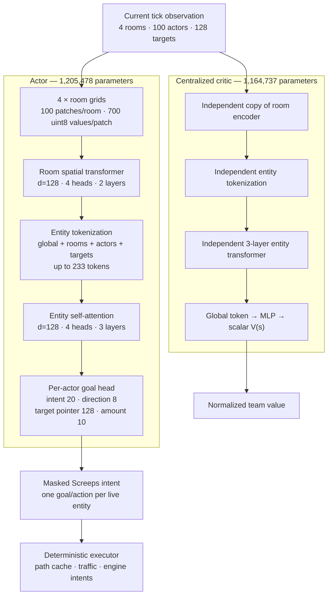

# Scalable entity-MAPPO refactor

## Status

Schema v2 is a clean break from the old 24-actor, two-slot policy. Old
checkpoints are intentionally incompatible. The workspace now contains a
schema-v2 joint-pretrain artifact and a 55-update PPO continuation. The joint
artifact has `meta.qualified=true` because the short experiment deliberately
relaxed its promotion thresholds; neither artifact is release-qualified.

Validated locally after the current refactor:

- 31/31 CPU learning and architecture contracts pass.
- Binary uint8 spatial observation round-trips through the real Node environment.
- Actor and critic each measurably respond to changes in peer entity state.
- The real PPO update is finite with per-actor likelihoods.
- The eager PPO path completed 112,640 environment steps and saved complete
  model, optimizer, reward-normalizer, and RNG continuation state.

The scripted-economy, seeded-expansion, and reward anti-recycling engine gates
must be rerun after every action/teacher ABI change. Artifact-level experimental
qualification is not evidence that the empty curriculum meets the release
milestones below.

Current evidence demonstrates an RCL1→RCL2 learned economy and the seeded
multi-room action contract. It is not evidence of reliable construction,
economy-funded expansion, or control at 64 live actors.

## Demonstrated failures in schema v1

1. The 24-actor cap silently dropped creeps and eventually the spawn/towers.
2. Active room count was frozen from the initial reset and PPO stored one room, making later expansion rooms invisible.
3. Each creep saw its own row and a shared room summary, but not peer rows. Coordinated assignment was unrepresentable.
4. The critic discarded actor and target tables entirely.
5. PPO summed every actor likelihood, exponentiated the team product ratio, and clipped the whole state when any factors moved. Ratio variance therefore grew with population.
6. Two identical unrestricted intent slots did not correspond to two executable Screeps actions. Conflicting primary intents were resolved by engine rules, not policy ordering.
7. The default maximum rollout buffer reserved roughly 50 GiB before the first step.
8. Gamma 0.99 and reset-end length heuristics were mismatched to thousand-tick economic investments.
9. The scripted teacher stopped at four generic workers and never placed a construction site.

## Schema-v2 design

### Current model diagram

The two trunks have identical architecture but separate weights. Each trunk has
1,131,584 parameters: 486,528 in the per-room spatial encoder, 595,008 in the
entity transformer, 49,792 in projections/coordinate/categorical embeddings,
and 256 in the final normalization. The actor adds 73,894 action-head
parameters; the critic adds a 33,153-parameter value head. Total trainable
parameters are **2,370,215**. The transformer is spatial/entity attention over
one tick; it has no temporal attention window or learned recurrent memory yet.

### Representation

- Capacity: four observation room slots, 64 separately budgeted creep actors,
  36 separately budgeted spawn/tower actors, and 128 balanced targets.
- Spatial channels are normalized uint8 on wire and host, then dequantized at model ingress.
- Categorical semantics use embeddings instead of relying only on ordinal floats.
- Fourier x/y features expose both local entity positions and stable room-world offsets relative to the seed room.
- A patch transformer creates room tokens.
- Three entity-attention layers jointly contextualize the global token, rooms, actors, and targets.
- The actor reads contextual actor/target tokens; the critic reads the contextual global token.

The actor and critic remain separate networks. This costs 2.370M total parameters and avoids actor gradients being shaped by value regression, while both receive the same complete observation structure.

### Action contract

Each actor selects one goal-conditioned intent and its active arguments. Targeted economy/combat intents perform one deterministic traffic-aware navigation or work step and reuse cached paths. This removes duplicate primary-action permutations and shortens the learned horizon, but goal persistence still requires the planned option state below.

Construction selects an explicitly validated free position plus a controller-legal structure type; invalid anchor/direction cross-products are not represented. Spawn actions expose only affordable worker, miner, hauler, upgrader, builder, and claimer bodies. Resource amounts are intent-specific and clamped to the executable source/destination capacity. Cross-room controller/source targets remain representable for mobile actors.

Target candidates are `[intent, target]`; actor capability remains `[actor, intent]`, and room compatibility is derived from entity room IDs. This shrinks target legality from 48,384 bytes at 24×2×21×48 to 2,560 bytes at 20×128 despite much larger actor capacity. Target packing is balanced by room and semantic category so mature-room extensions cannot deterministically evict all sites, creeps, and placement positions.

### Learning

- Actor output includes one log-probability and entropy per live actor.
- PPO ratios, clipping, KL, and entropy are computed per actor, averaged within each transition, then averaged across transitions. A 64-creep state therefore has the same team-state weight as a one-creep bootstrap state. The team reward/advantage remains shared.
- BC is computed per active conditional factor. A masked or non-finite teacher
  label fails the strict contract instead of discarding a whole actor or state.
- The centralized critic attends to all actors, targets, rooms, and globals.
- Advantages are normalized once per rollout.
- Critic targets retain lambda=1; policy lambda is explicitly 0.97 rather than inferred from an unrelated partial episode length.
- Gamma is 0.999 for economic horizons.
- Random-policy critic-only warmup is disabled.

The external score remains raw harvest plus controller progress. PPO additionally
receives productive-delivery, construction-progress, and one-time room-claim
channels. Harvest has a smaller training weight than conversion, and there is no
direct spawn bonus, so extraction-only and spawn-churn policies are disfavored.

### Systems

- Base rollout storage is about 1.27 GiB for 512×8 with all four room slots and
  100 actor rows, instead of preallocating the old 20k cap.
- A competent rollout can extend once by 256 steps, bounded by a 1,024-step cap; it cannot repeatedly grow to a multi-dozen-GiB allocation in one update.
- Spatial storage and IPC are four times smaller through uint8 quantization.
- Acting and PPO retain all room slots, so expansion mid-episode does not change the training observation contract.

## Release qualification criteria

The current experimental artifacts do not meet these criteria. Do not resume
the old `runs/policy.pt`; it belongs to the failed schema-v1 stack.

1. The expert corpus includes construction/refill/body-selection/claim trajectories
   with zero masked or rejected labels for every specialist role.
2. Held-out closed-loop evaluation measures delivery, construction, RCL milestones,
   invalid actions, task churn, collisions, actor utilization, and actor-count buckets.
3. Joint pretraining reports per-factor validation losses and saves complete
   optimizer/config/schema/RNG provenance; partial snapshots cannot start PPO.
4. The cloned actor reaches a declared held-out score threshold in fresh closed
   loop, not merely low NLL on the final training chunk.
5. A 32–48 actor functional scenario verifies that no creep, structure controller,
   visible room, or required candidate category is silently truncated.

## Remaining architectural work

The current fast controller is now capable of coordination, but a powerful multi-room empire still needs a slower strategic layer. The next model phase should be explicit:

1. Run an empire/room planner every 25 ticks over the contextual room and global tokens. It chooses desired role counts, spawn/body queues, one build candidate per room, controller allocation, and claim/reserve priorities.
2. **TODO — model-owned persistent memory.** Give every creep a persistent
   12-element BF16 memory vector and give the empire/global token its own
   persistent 12-element BF16 vector. At tick `t`, the actor reads the current
   vectors together with the observation, emits the environment action, and
   writes the vectors used at tick `t+1`. The critic reads the same pre-action
   memory state. Bind creep memory to a stable creep ID rather than a packed
   actor row; zero-initialize it on spawn, delete it on death, and zero all
   memory on episode reset. Mask structure rows out of creep memory. Store
   pre-action memory and stable-ID mapping in every rollout transition and
   checkpoint the live global/per-creep memory for interactive continuation.
   PPO training must replay contiguous sequences with burn-in/truncated BPTT;
   shuffled independent transitions are not valid for this recurrent path.
   Bound or normalize writes, expose read/write magnitude and memory-reset
   diagnostics, and add contracts for actor-row reorder, death/respawn, room
   travel, episode reset, checkpoint resume, and gradient flow across ticks.
   Do not treat an unmodelled continuous write as a free action: implement the
   write as the recurrent state transition that is recomputed during PPO.
3. Store a typed option for every creep: task, target/room, priority, start tick, and expiry. The fast actor chooses continue, cancel, or replace before issuing movement/work. Option state must be part of the observation and rollout, not hidden executor state. Encode the structured option alongside, rather than inside, the 12-float learned memory so it remains inspectable.
4. Split action domains into room decisions, spawn/structure decisions, creep task assignment, movement, and primary work/combat. A room actor owns construction and expansion plans; arbitrary creeps no longer place strategic sites.
5. Add centralized value heads for team return, per-room return, construction/logistics progress, and territorial progress, with PopArt or equivalent target-scale adaptation. PPO still optimizes the team objective; auxiliary heads improve stage-specific credit and diagnostics.
6. Replace the balanced fixed global target table with typed actor-local top-k
   candidates once saturation scenarios expose the needed bucket sizes. Keep
   deterministic overflow accounting and compile a small set of entity-count buckets.
7. Train strategic and tactical heads with stage-balanced BC, then DAgger on learner-visited states, then PPO. A major PPO run is gated on held-out closed-loop imitation, not training-set NLL.

This is the principled route to longer credit assignment and lower task churn; simply enlarging PPO rollouts is not.

The current simulator materializes only the seed room and one connected neighbor
and seeds GCL2. Four room slots are therefore an observation ABI, not evidence of
four-room competence. The expansion curriculum also exposes the neighbor before
ordinary scouting would provide vision. Treat that as privileged curriculum data;
a production actor still needs visible-only intel, exit/scout goals, three- and
four-room scenario families, staged GCL3/GCL4, and held-out topology seeds.

## PPO evidence and next gates

The first schema-v2 PPO run completed 55 updates / 112,640 environment steps.
On the fixed empty-room seed-0 evaluation, sampled shaped return improved from
6,372.3 after joint pretraining to 8,315.0 after PPO (+30.5%). Deterministic
return did not improve, so useful upgrading behavior remains stochastic rather
than modal. This is one-scenario evidence, not a qualification result.

Before extending PPO:

1. Eliminate dynamic transfer-mask/executor disagreement. The run rejected
   10,412 of 44,809 transfer intents; same-tick contention and target capacity
   must be represented or handled without training on rejected actions.
2. Diagnose observation overflow. It averaged 28.3% over the final ten
   rollouts and reached 75% in one rollout. Add actor/target/room saturation
   gates instead of silently increasing dense caps.
3. Record curriculum identity on completed episode returns and evaluate every
   curriculum under several scenario and action seeds. Report raw H+C, shaped
   return, delivery, construction, claims, invalid actions, overflow, role mix,
   dropped energy, and population.
4. Gate economic composition: prevent excess generalist/harvester spawning,
   require hauler coverage for dropped energy, establish remote-room staffing,
   and score construction placement quality rather than construction volume
   alone.
5. Preserve `seed_creep` and `seed_claimer` competence with stage-balanced
   sampling/evaluation; both regressed while empty and seed-full improved.
6. Extend temporal credit with explicit options/model-owned memory or a
   justified longer-lambda sequence experiment. A 512-tick rollout does not
   create temporal transformer context.
