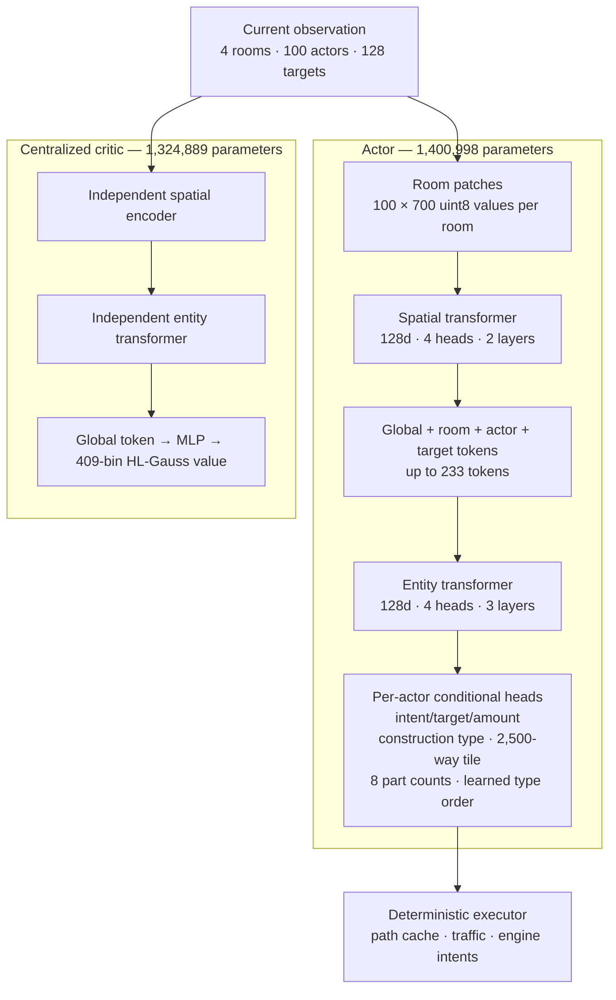

# RL architecture

This document describes the implemented schema-v4 model and environment
contract. Training choices and unresolved alternatives are documented
separately in [`TRAINING.md`](./TRAINING.md) and [`ROADMAP.md`](./ROADMAP.md).

## Scope

The stack controls an `xxscreeps` economy through one masked, goal-conditioned
action per live creep, spawn, or tower on every simulator tick. It currently
supports four observation room slots, up to 64 creep actors, 36 structure
actors, and 128 target candidates.

The simulator currently materializes only the seed room and one connected
neighbor at GCL2. Four room slots are an ABI capacity, not evidence of
four-room competence. The learned artifacts demonstrate an RCL1-to-RCL2
economy on one map and a seeded expansion action contract; they do not
demonstrate reliable economy-funded expansion or control of 64 live creeps.

## Model



| Network | Trunk | Head | Total |
|---|---:|---:|---:|
| Actor | 1,239,104 | 161,894 | **1,400,998** |
| Critic | 1,239,104 | 85,785 | **1,324,889** |
| Combined training model | — | — | **2,725,887** |

The actor alone is sufficient for deployment. Actor and critic trunks have the
same architecture but do not share weights. This isolates the actor
representation from value-regression gradients, while duplicating room
encoding and entity-attention work during training. Sharing lower spatial
tokenization is an unresolved performance/representation experiment, not a
settled design decision.

### Observation encoder

| Field | Shape | Meaning |
|---|---:|---|
| `patches` | `[4,100,700]` uint8 | Four 50×50 rooms as 5×5 patches with 28 channels |
| `room_coords` | `[4,2]` | Stable world offsets relative to the seed room |
| `actors` | `[100,36]` | 64 creep rows plus 36 room/spawn/tower rows; exact total/active body counts and entity resources/state |
| `actor_outcome` | `[100]` uint8 | Previous action result joined by stable entity identity |
| `targets` | `[128,24]` | Typed entities, resources, sites, and controllers |
| `construction_mask` | `[4,7,313]` uint8 | Bit-packed engine legality for every room/type/tile |
| `globals` | `[12]` | Economy, population, room, and overflow summaries |

The patch transformer produces one contextual token per room. Actor and target
rows receive learned categorical embeddings, Fourier position features, and
their room token. Three entity-attention layers jointly contextualize the
global token, rooms, actors, and targets. Consequently each creep can respond
to peer state, and the critic can value the actual entity set rather than only
a compressed room image.

Static terrain is transported with dynamic spatial features today. Sparse
dynamic entities and reusable static map embeddings remain a performance
opportunity.

### Policy distribution

The entity transformer coordinates actors through a shared current-state
representation. Given that representation, actors are decoded in parallel.
Within each actor, the policy first selects an intent and then evaluates the
arguments required by that intent:

```text
π(team action | state) = product over live actors of π(actor action | state)

π(actor action | state)
  = π(intent | state)
  × π(direction | intent, state)       when required
  × π(target | intent, state)          when required
  × π(amount | intent, target, state)  when required
  × π(construction type | room, state)
  × π(construction tile | type, room, state)
  × π(part counts, positive-type order | room energy, state) for spawn
```

This is an exact joint distribution over the emitted team action under the
current conditional-independence structure. The model exposes factor-, actor-,
and team-level log-probabilities. How PPO should group their likelihood ratios
is a learning-objective question, not an architecture fact; see
[`ROADMAP.md`](./ROADMAP.md#joint-policy-ratio-ablation).

The current policy is not autoregressive across creeps. It cannot condition a
later creep's action on actions already selected for earlier creeps. Peer
attention can still split work based on state, identity, position, body, and
economy context, but explicit collision-free assignment may benefit from a
slower autoregressive task planner.

### Action-conditioned latent dynamics

Both independent trunks learn a one-step world model. For a valid transition,
the actor and critic each encode the current world to a 128-dimensional latent.
A separate dynamics MLP consumes that latent plus a pooled encoding of the full
joint action and predicts the next world latent. The next observation is never
an input to the predictor: its encoding is a detached target only. Episode
ends, resets, truncations, and the final row of a rollout are masked.

The critic additionally compares the predicted next value distribution with
the detached value distribution at the real next state, evaluating the student
through detached value-head weights. Actor and critic dynamics are not shared
because their trunk coordinate systems are independently learned. PPO freezes
the behavior/pre-update latent targets for the whole three-epoch update, making
the objective independent of minibatch shuffle order.

### Action and executor contract

Each actor selects one of 20 intents. Direction, target, amount,
spawn count and spawn ordering factors are active only when
required by the selected intent. Masks close illegal
types and arguments before sampling.

Targeted intents represent persistent-looking goals but execute exactly one
navigation or primitive work step per tick. The deterministic executor supplies
path caching, traffic-aware movement, range approach, and final engine intents.
The policy must currently reselect its goal on every tick.

Construction is exclusive to owned-room actors and samples a structure type,
then one exact 50×50 tile from the engine validator's authoritative bit-packed
support. Construction tiles do not consume shared entity-target capacity. A
spawn chooses one count from 0–50 for each of the eight part types. A fixed
eight-step conditional scan gives exact likelihoods while restricting support
to nonempty, affordable compositions with at most 50 parts. A learned
Plackett–Luce permutation orders the nonzero types, and zero-count types use a
canonical suffix so equivalent bodies have one representation. There is no
separate length action, 50-token decoder, or cross-tick energy reservation.
Existing creep tokens embed
exact total and active counts for all eight body-part types; human-readable role
names are body-derived telemetry only. Transfer and
withdraw amounts are conditioned on the selected target's
available energy or capacity. Cross-room goals are available to mobile creeps;
structure actors remain room-local.

### Critic

The centralized critic receives every room, actor, target, and global feature
available to the actor. Its contextual global token feeds a 409-class
HL-Gauss head over a symlog return support with exact anchors at zero and
±1e9. Expected value is decoded for bootstrapping; critic training uses
categorical cross-entropy, a fixed 0.5 gradient cap, and no value clipping.
The team value is currently the only trained value objective. Per-room
and progress-channel auxiliary values remain roadmap work.

## Temporal boundary

All attention is within the current tick. There is no temporal transformer
window, recurrent hidden state, persistent learned creep memory, or persistent
strategic option in the model. Path caching in the executor is operational
state, not model memory, and is invisible to PPO.

Long-lived tasks, learned memory, sequence replay, and a slower strategic
controller are specified in [`ROADMAP.md`](./ROADMAP.md#temporal-memory-and-options).

## Environment state snapshots

A snapshot is the exact post-tick world the environment just observed.
`env/snapshot.mjs` writes it as an `XSNP` container: a 16-byte header, UTF-8
JSON metadata, then the concatenated room blobs that metadata addresses by
offset and length. Room blobs are the engine's own serialization, copied
verbatim. The file is written to a temporary name and renamed, so a reader
never observes a partial snapshot.

A snapshot captures the blob of every room an episode can have modified; the
cross-tick processor scratch a room blob does not contain, which is the active
and sleeping room sets, each room's pending `intents` and `finalIntents`, and
the controlled and reserved room sets that enforce the global control level's
room cap; the scenario RNG state, because that stream drives generated
identifiers and movement tie-breaks; and the session bookkeeping the reward and
observation depend on, which is the reward baselines, remote-cargo attribution,
and the previous-action outcomes joined by stable entity identity. Restoring the
baselines is what makes the first post-restore reward a true delta rather than a
spike, and restoring the claim budget is what stops a restored segment from
claiming past a cap that a fresh evaluation world enforces. Derived
relationships, the user-room map and the active-user set, are rebuilt from the
restored rooms rather than copied, so a restore cannot resurrect state from the
process that captured it. Every boot reply reports `info.controlledRooms`, so
the restored budget is auditable without an extra step.

The captured room set is the union of the processor queues, the player's
intent, presence, and vision rooms, and the seed and expansion rooms. The queues
alone are not sufficient: a room put to sleep with an infinite wake time belongs
to neither queue, and player residue that schedules no wake-up — a construction
site, for example — would then be restored from the pristine imported blob.

Executor route caches are deliberately not captured. They are per-process
operational state, cleared by `resetNavigationCaches()` in `env/actions.mjs` at
every episode start and every restored-segment start, so a restored world runs
with a cold cache exactly like a fresh one. This is the same operational state
the temporal boundary above excludes from model memory.

The command protocol is XAC1 version 6. Two opcodes carry start states, both
with a UTF-8 JSON payload `{"path": str, "events": [str]}`:

| Opcode | Command | Reply |
|---:|---|---|
| 9 | `snapshot` | writes the file, returns `info.snapshot` with path, bytes, tick, step, rooms, curriculum, expert flag, and event tags; no observation |
| 10 | `restore` | a `reset` reply, plus `info.restored`, `info.snapshotTick`, and `info.step` |

A restore instantiates a fresh shard and applies the captured state to it.
Expert code is never reloaded, so a state collected while The International was
driving restores into a plain learner session. Snapshot metadata carries a
world identity — seed room, expansion room, source count, schema version, and
the observation and action ABI identifiers — and a restore into a mismatched
environment fails loudly instead of training on a different world.

Every step reply carries `info.events`, the tags that fired on that tick:
`pre_spawn`, `post_spawn`, `pre_claim`, `post_claim`, `remote_outbound`,
`remote_at_source`, `remote_loaded_home`, `replacement_due`, `rcl_up`, and
`recovery`. A `pre_*` tag marks a state whose strategic decision is still open:
`pre_spawn` fires when at least one home spawn is free and the home room's own
spawn and extension energy can already afford a useful worker body, and
`pre_claim` fires when a claim-capable creep exists and a neutral outpost is
visible. A policy restored at those states must make the decision itself rather
than inherit the collecting teacher's. The `post_*` tags mark the tick after
that decision was committed — a spawn body accepted, a controller claimed — and
the remaining tags mark the execution and recovery states the decision leads to.
The remote tags describe the economy, not mere presence: `remote_outbound`
requires live `CARRY`, `remote_at_source` requires live `WORK` next to a source,
and `remote_loaded_home` fires only once remotely mined cargo is back in the home
room, which is where the delivery decision actually is.

Measured fidelity: restoring a snapshot in a different process reproduces
byte-identical observations and a byte-identical 30-tick scripted continuation,
an incompatible snapshot is rejected, and a claimed room's budget survives the
round trip; `agent/test_state_snapshot.py` asserts all four. Snapshots are
small, because a room blob is the whole payload: a `seed_outpost` capture at
tick 401 under seed 3 measures 3,842 bytes, and a six-environment PPO run
averaged 7.2 KB per snapshot.

## Compatibility

`schema.json` is the executable capacity and ABI contract. Checkpoints include
the full semantic schema plus artifact, model, observation, action, reward,
teacher, and learning ABI identifiers. Schema-v1 checkpoints are intentionally
incompatible with this model.
